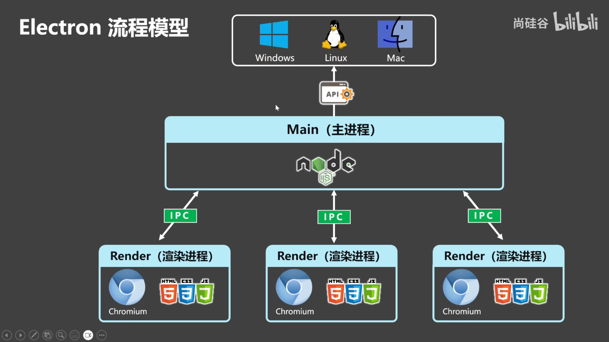

# electron

- Reference - dev

  [electron](https://www.electronjs.org/), [electron cn](https://electron.nodejs.cn/), 

- Reference - course

  [atguigu 1h](https://www.bilibili.com/video/BV1sE421N7M5/), [udemy](https://www.bilibili.com/video/BV1pY4y1i7Ac/), [esaychat](https://www.bilibili.com/video/BV1qz421Y7zR/), [10h](https://www.bilibili.com/video/BV1xd4y1J7dB/), [music](https://www.bilibili.com/video/BV1FFpTeqEyZ/), 
  
- Reference - blog

  


## 快速入门

- 背景介绍

  使用*HTML、CSS、JavaScript*来构建*跨平台*的*桌面应用* (安装包体积有点大)

- 核心概念

  Electron = `Chromium`(页面 HTML CSS JS) + `NodeJS`(后台操作 System) + `NativeAPI`(Win Mac Linux)

- 工作流程

  **Main 主进程**：NodeJS环境，*管理多个渲染进程*、*可调用NativeAPI*

  **Render 渲染进程**：Chromium环境，*窗口页面* (依赖环境打进去)

  **IPC 进程通信**：

  

- 三种核心的进程通信方式

  


- 新建项目

  https://www.electronjs.org/zh/docs/latest/tutorial/quick-start

  ```bash
  node -v  # v18.17.1
  npm -v  # 9.6.7
  
  cd /opt/code/frontend-code/hello-frontend/code-show
  mkdir electron_learning && cd electron_learning/ 
  npm init  # author description 为打包的必填项
  
  npm i electron -D  # npm install --save-dev electron
  touch main.js
  mkdir pages && touch pages/index.html pages/index.css
  
  npm start
  
  ```

  package.json

  ```json
  {
    "name": "electron_learning",
    "version": "1.0.0",
    "description": "This is a learning project for electron",
    "main": "main.js",
    "scripts": {
      "test": "echo \"Error: no test specified\" && exit 1",
      "start": "electron ."
    },
    "author": "oswin",
    "license": "ISC",
    "devDependencies": {
      "electron": "^32.1.0"
    }
  }
  
  ```

  main.js

  ```js
  const { app, BrowserWindow } = require("electron");
  
  app.on("ready", () => {
    // BrowserWindow conf
    // https://www.electronjs.org/zh/docs/latest/api/browser-window
    // https://wizardforcel.gitbooks.io/electron-doc/content/api/browser-window.html
    const win = new BrowserWindow({
      width: 800,
      height: 600,
      autoHideMenuBar: true,
      x: 0,
      y: 0,
      alwaysOnTop: true,
    });
    win.loadURL("https://github.com");
  });
  
  ```

- electron安装失败

  https://www.cnblogs.com/makalochen/p/16154510.html

  https://blog.csdn.net/oNuoZuo/article/details/140712310

  ```bash
  npm config edit
  registry=https://registry.npmmirror.com
  electron_mirror=https://cdn.npmmirror.com/binaries/electron/
  electron_builder_binaries_mirror=https://npmmirror.com/mirrors/electron-builder-binaries/
  
  npm cache clean --force
  npm i electron -D 
  
  ```

  


