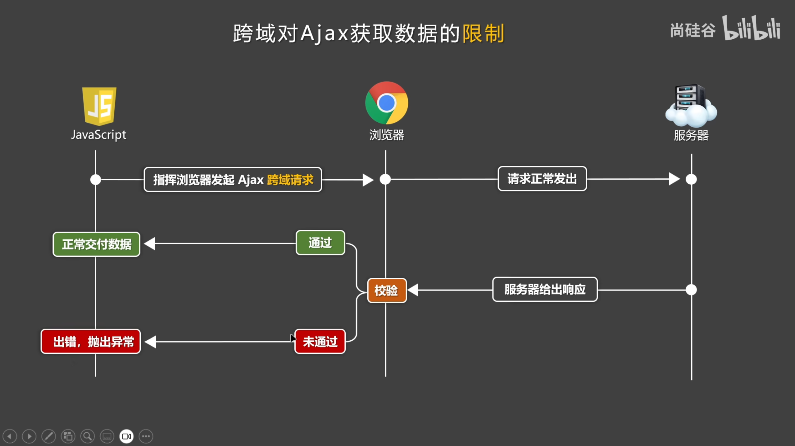
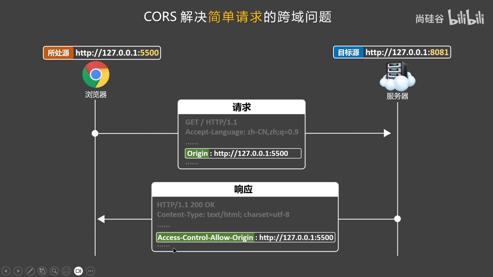

# frontend-question

- Reference

  [daily.dev](https://daily.dev/)

  [js.module](https://blog.csdn.net/qq_63358859/article/details/140797114)
  
  
  
  


## 前端实战

### js模块化


### 跨域问题

#### 跨域问题是什么

- 概念

  **源** = *协议* + *域名* + *端口号* (路径无关)

  **同源**：协议 + 域名 + 端口号 一致 (否则**非同源** 即**异源**即**跨域**)

  **同源请求**：所处源和目标源 一致 

- 浏览器的同源策略 

  浏览器为了确保资源安全，而遵循的一种策略

- 非同源的限制

  1. DOM访问限制：源A的脚本不能读取和操作源B的DOM `framePage.contentWindow.document`
  2. Cookie访问限制：源A不能访问源B的Cookie `framePage.contentWindow.document.cookie`
  3. Ajax响应数据限制：源A可以给源B发请求，但是*无法获取源B响应数据* !!!

- 注意

  跨域限制仅存在*浏览器端*，服务端不存在跨域限制

  即使跨域了，ajax请求也能正常发出，但响应数据不会得到

  浏览器对某些标签跨域不做严格限制 <link> <script>  ...

  

  


#### 跨域问题是什么 demo

- DOM 同源不限制

  index1.html

  ```html
  <!DOCTYPE html>
  <html lang="en">
    <head>
      <meta charset="UTF-8" />
      <meta name="viewport" content="width=device-width, initial-scale=1.0" />
      <title>page1</title>
    </head>
  
    <body>
      <!-- http://127.0.0.1:5500/CrossDomain/ConstraintsDOM/index1.html -->
      <!-- http://127.0.0.1:5500/CrossDomain/ConstraintsDOM/index2.html -->
      <h2>page1</h2>
      <button onclick="showDOM()">Get DOM of page2</button>
  
      <br />
      <iframe id="framePage" src="./index2.html"></iframe>
  
      <script type="text/javascript">
        function showDOM() {
          // console.log(document);  // page1
  
          const framePage = document.getElementById("framePage");
          console.log(framePage.contentWindow.document.body); // page2
        }
      </script>
    </body>
  </html>
  
  ```

  index2.html

  ```html
  <!DOCTYPE html>
  <html lang="en">
    <head>
      <meta charset="UTF-8" />
      <meta name="viewport" content="width=device-width, initial-scale=1.0" />
      <title>page2</title>
    </head>
  
    <body>
      <h2>page2</h2>
    </body>
  </html>
  
  ```

- DOM 不同源限制

  ```html
  <!DOCTYPE html>
  <html lang="en">
    <head>
      <meta charset="UTF-8" />
      <meta name="viewport" content="width=device-width, initial-scale=1.0" />
      <title>page1</title>
    </head>
  
    <body>
      <!-- http://127.0.0.1:5500/CrossDomain/ConstraintsDOM/index1.html -->
      <!-- https://www.baidu.com/ -->
      <h2>page1</h2>
      <button onclick="showDOM()">Get DOM of page2</button>
  
      <br />
      <iframe id="framePage" src="https://www.baidu.com/"></iframe>
  
      <script type="text/javascript">
        function showDOM() {
          const framePage = document.getElementById("framePage");
          console.log(framePage.contentWindow.document); // page2 x
        }
      </script>
    </body>
  </html>
  
  ```

  


---

- Cookie 同源不限制

  index1.html

  ```html
  <!DOCTYPE html>
  <html lang="en">
    <head>
      <meta charset="UTF-8" />
      <meta name="viewport" content="width=device-width, initial-scale=1.0" />
      <title>page1</title>
    </head>
  
    <body>
      <!-- http://127.0.0.1:5500/CrossDomain/ConstraintsCookie/index1.html -->
      <!-- http://127.0.0.1:5500/CrossDomain/ConstraintsCookie/index2.html -->
      <h2>page1</h2>
      <button onclick="showDOM()">Get Cookie of page2</button>
  
      <br />
      <iframe id="framePage" src="./index2.html"></iframe>
  
      <script type="text/javascript">
        document.cookie = "name=page1";
  
        function showDOM() {
          // console.log(document.cookie); // page1
  
          const framePage = document.getElementById("framePage");
          console.log(framePage.contentWindow.document.cookie); // page2
        }
      </script>
    </body>
  </html>
  
  ```

  index2.html

  ```html
  <!DOCTYPE html>
  <html lang="en">
    <head>
      <meta charset="UTF-8" />
      <meta name="viewport" content="width=device-width, initial-scale=1.0" />
      <title>page2</title>
    </head>
  
    <body>
      <h2>page2</h2>
      <script>
        document.cookie = "name=page2";
      </script>
    </body>
  </html>
  
  ```

- Cookie 不同源限制

  ```html
  <!DOCTYPE html>
  <html lang="en">
    <head>
      <meta charset="UTF-8" />
      <meta name="viewport" content="width=device-width, initial-scale=1.0" />
      <title>page1</title>
    </head>
  
    <body>
      <!-- http://127.0.0.1:5500/CrossDomain/ConstraintsCookie/index1.html -->
      <!-- https://www.baidu.com/ -->
      <h2>page1</h2>
      <button onclick="showDOM()">Get Cookie of page2</button>
  
      <br />
      <iframe id="framePage" src="https://www.baidu.com"></iframe>
  
      <script type="text/javascript">
        document.cookie = "name=page1";
  
        function showDOM() {
          const framePage = document.getElementById("framePage");
          console.log(framePage.contentWindow.document.cookie); // page2
        }
      </script>
    </body>
  </html>
  
  ```

  


---

- AjaxResponse 非同源限制

  ```html
  <!DOCTYPE html>
  <html lang="en">
    <head>
      <meta charset="UTF-8" />
      <meta name="viewport" content="width=device-width, initial-scale=1.0" />
      <title>page1</title>
    </head>
  
    <body>
      <!-- http://127.0.0.1:5500/CrossDomain/ConstraintsAjaxResponse2/index1.html -->
      <!-- https://www.toutiao.com/hot-event/hot-board/?origin=toutiao_pc -->
  
      <button onclick="getNews()">Get News</button>
  
      <script>
        async function getNews() {
          const url =
            "https://www.toutiao.com/hot-event/hot-board/?origin=toutiao_pc";
          let resule = await fetch(url);
          let data = await resule.json();
          console.log(data);
        }
      </script>
    </body>
  </html>
  
  ```

  


#### 跨域问题的解决：CORS 

- 概念 (CORS规范的分类)

  **简单请求**：请求方法GET POST HEAD、不手动改请求头、请求头Content-Type只能是`text/plain`, `multipart/form-data`, `application/x-www-form-urlencoded`

  **复杂请求**：不是简单的就是复杂请求，复杂请求会自动发送**预检请求** (`application/json`)

- 跨域问题的解决 (*让浏览器校验通过*)

  跨域资源共享 Cross-Origin Resource Sharing：添加特定**响应头**来控制浏览器检验 (规范)

  服务器明确表示*拒绝*跨域请求，或*没有表示*，则浏览器校验不通过

  服务器明确表示*允许*跨域请求，则浏览器校验通过

- How *要求服务器是自己人*

  服务器返回浏览器时，添加特定响应头，告诉浏览器可以校验通过 (解决跨域)

  `Access-Contronl-Allow-Origin`, 

  

  


---

- server

  ```bash
  cd CrossDomain/SolutionCORS/server/
  npm init
  npm i express
  touch server.js
  
  ```
  
  server/server.js

  ```js
  // npm install -g nodemon
  // nodemon server.js
  
  const express = require("express");
  const app = express();
  
  const students = [
    { id: "2424001", name: "ZhangSan", age: 20 },
    { id: "2424002", name: "LiSi", age: 21 },
    { id: "2424003", name: "WangWu", age: 22 },
  ];
  
  app.get("/students", (req, res) => {
    res.setHeader("Access-Control-Allow-Origin", "http://127.0.0.1:5500"); // *  // 只能处理简单请求
    res.send(students);
  });
  
  app.listen(8081, () => {
    console.log("server is running at http://localhost:8081");
  });
  
  ```
  
  client/index.html
  
  ```html
  <!DOCTYPE html>
  <html lang="en">
    <head>
      <meta charset="UTF-8" />
      <meta name="viewport" content="width=device-width, initial-scale=1.0" />
      <title>page-client</title>
    </head>
  
    <body>
      <!-- http://127.0.0.1:5500/CrossDomain/SolutionCORS/client/index1.html -->
      <!-- http://localhost:8081/student -->
  
      <button onclick="getStudents()">Get students</button>
  
      <script>
        async function getStudents() {
          const url = "http://localhost:8081/students";
          let result = await fetch(url);
          let data = await result.json();
          console.log(data);
        }
      </script>
    </body>
  </html>
  
  ```
  
  


#### 跨域问题的解决：CORS 

- 预检请求

  先于跨域请求，自动发送预检请求(`OPTIONS`)，预检请求向服务器确认是否允许后面的跨域请求

  若预检通过，则发起实际跨域请求

- How *客户端发起*

  预检请求的请求头：`Origin`(发起请求的源), `Access-Control-Request-Method`(实际请求的http方法), `Access-Control-Request-Headers`(实际请求自定义的头)

  


---

- server/server.js

  ```js
  
  ```

  client/index.html

  ```html
  <!DOCTYPE html>
  <html lang="en">
    <head>
      <meta charset="UTF-8" />
      <meta name="viewport" content="width=device-width, initial-scale=1.0" />
      <title>page-client</title>
    </head>
  
    <body>
      <!-- http://127.0.0.1:5500/CrossDomain/SolutionCORS2/client/index.html -->
      <!-- http://localhost:8081/student -->
  
      <button onclick="getStudents()">Get students</button>
  
      <script>
        async function getStudents() {
          const url = "http://localhost:8081/students";
          let result = await fetch(url, {
            method: "GET",
            headers: { school: "JiaLiDung" }, // 复杂请求
          });
          let data = await result.json();
          console.log(data);
        }
      </script>
    </body>
  </html>
  
  ```

  


### 前端项目打包上线


### 图片上传


### vscode内嵌


