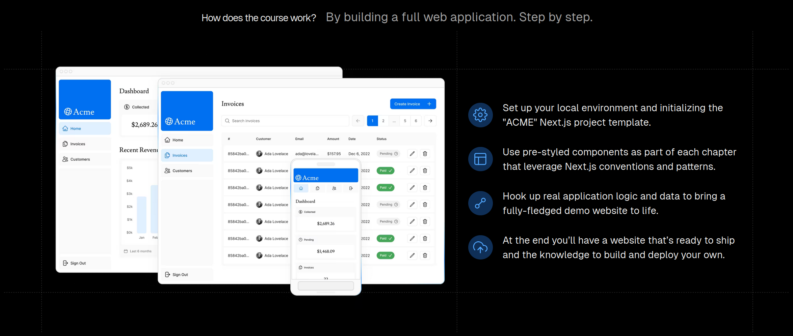

# nextjs

- Reference

  [nextjs org](https://nextjs.org/), [nextjs zh](https://www.nextjs.cn/), 

  


- nextjs

  用于构建*全栈*web应用的react框架

  简化：项目配置与优化

  SSR：支持服务端渲染


- 案例：财务操作页面

  网页端 + 移动端 (弹性布局)

  Login: no-auth

  Dashboard / Home: 

  Invoices: CRUD

  Customer: 

  

- 知识点

  样式处理、路由系统、数据获取、错误处理

  优化图片与字体、身份验证 ...


- 新建项目

  ```bash
  npx create-next-app nextjs-blog --use-npm --example "https://github.com/vercel/next-learn-starter/tree/master/learn-starter"
  cd nextjs-blog
  npm run dev  
  
  ```

  


