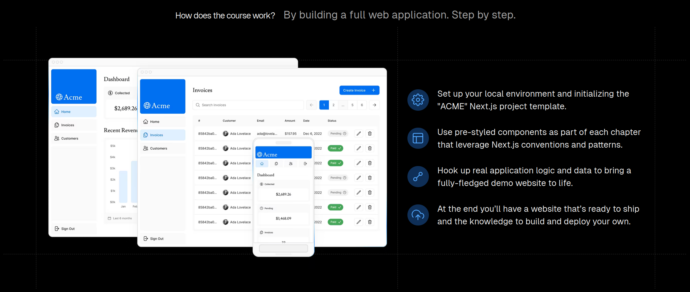

# nextjs

- Reference

  [nextjs org](https://nextjs.org/), [nextjs zh](https://www.nextjs.cn/), 

  [nextjs react (udemy course)](https://www.bilibili.com/video/BV1G54y1o7RP), [nextjs react (udemy note)](https://www.bilibili.com/read/cv20992052/)
  
  


## 背景介绍

- React

  用于构建*用户界面*的*库*

  额外需要路由、样式、认证等

- NextJS

  用于构建*全栈*web应用的*react框架*

  简化：基于约定开箱即用 项目配置与优化

  SSR：支持服务端渲染

- NextJS特性

  基于文件的路由

  预渲染 Pre-rendering (提升应用的性能 有利于搜索引擎优化SEO)

  API路由 (后端)

  CSS modules

  认证

  用于Dev / Prod的构建系统


### 基本概念

- 基本概念

  路由：

  预渲染和数据获取：

  


### 新建项目

- 新建项目

  ```bash
  node -v  # v18.19.1
  npm -v  # 9.5.1
  yarn -v  # 1.22.22  # npm install --global yarn
  
  npx create-next-app@12 hello-nextjs
  
  ```

- 项目结构

  ```bash
  hello-nextjs$ tree -L 3
  .
  ├── README.md
  ├── .gitignore
  │
  ├── package.json      	# 依赖声明 脚本封装 ✔		--- --->
  ├── node_modules      	# 依赖下载						  
  ├── yarn.lock         	# 依赖生成 yarn
  ├── .next             	# 自动生成 dev build
  │
  ├── next.config.js    	# 配置文件 next ✔
  ├── .eslintrc.json    	# 代码约束 eslint next ✔
  │
  ├── public            	# 公开资源
  │   ├── favicon.ico			# 
  │   └── vercel.svg			# 
  ├── pages             	# 页面 (基于页面的路由) ✔✔
  │   ├── api           		# 为应用创建后端接口
  │   │   └── hello.js  		#  ...
  │   ├── _app.js       		# 定义应用布局			<---
  │   └── index.js      		# 具体页面逻辑		<---
  └── styles            	# 样式css
      ├── globals.css   		# 全局样式
      └── Home.module.css		# 组件特定样式
  
  ```
  
  


## 路由

### 基于页面的路由 pages

- 基于页面的路由

  不用引入路由库、不用写路由文件、不用将页面组件引用到路由文件中
  
  ```bash
  rm -rf pages/api/ pages/index.js  # pages/_app.js 保留
  touch pages/index.js pages/about.js pages/profile.js
  rm -rf pages/about.js pages/profile.js
  
  # http://localhost:3000/          ---> pages/index.js
  # http://localhost:3000/about     ---> pages/about.js 
  # http://localhost:3000/profile   ---> pages/profile.js
  
  ```
  
  pages/index.js
  
  ```js
  function Home() {
    return (
      <div>
        <h1>Welcome to Next.js</h1>
        <p>Hello oswin!</p>
      </div>
    );
  }
  
  export default Home;
  
  ```
  
  pages/about.js 
  
  ```js
  function About() {
    return (
      <div>
        <h1>About Page</h1>
        <p>This is the about page of my website.</p>
      </div>
    );
  }
  
  export default About;
  
  ```
  
  pages/profile.js
  
  ```js
  function Profile() {
    return (
      <div>
        <h1>Profile Page</h1>
        <p>Welcome to your profile page!</p>
      </div>
    );
  }
  
  export default Profile;
  
  ```
  
  


### 嵌套路由 mkdir 

- 任务

  ```bash
  # http://localhost:3000/blog/        # 博客列表          ---> pages/blog/index.js  # pages/blog.js
  # http://localhost:3000/blog/first   # 第1篇博客         ---> pages/blog/first.js
  # http://localhost:3000/blog/second  # 第2篇博客         ---> pages/blog/second.js
  
  touch pages/blog/index.js pages/blog/first.js pages/blog/second.js
  
  ```

  pages/blog/index.js (pages/blog.js)

  ```js
  function Blog() {
    return (
      <div>
        <h1>Blog List</h1>
        <p>This is the blog list page.</p>
      </div>
    );
  }
  
  export default Blog;
  
  ```

  pages/blog/first.js 

  ```js
  function FirstBlog() {
    return (
      <div>
        <h1>First blog post</h1>
        <p>balalalalala</p>
      </div>
    );
  }
  
  export default FirstBlog;
  
  ```

  pages/blog/second.js

  ```js
  function SecondBlog() {
    return (
      <div>
        <h1>Second blog post</h1>
        <p>balalalalala</p>
      </div>
    );
  }
  
  export default SecondBlog;
  
  ```

  


### 动态路由 [Id].js

- 任务

  ```bash
  # http://localhost:3000/book/        # 书籍列表          ---> pages/book/index.js 
  # http://localhost:3000/book/1       # 第1本书籍         ---> pages/book/[bookId].js  bookId=1  # 数据后端取
  # http://localhost:3000/book/2       # 第2本书籍         ---> pages/book/[bookId].js  bookId=2  # 数据后端取
  # http://localhost:3000/book/flipped # 书籍flipped       ---> pages/book/flipped.js  # 静态路由 优先级大 !!
  
  touch pages/book/index.js pages/book/[bookId].js
  touch pages/book/flipped.js
  
  ```

  pages/book/index.js 

  ```js
  function BookList() {
    return (
      <>
        <h1>Book Page</h1>
        <h3>Book 1</h3>
        <h3>Book 2</h3>
      </>
    );
  }
  
  export default BookList;
  
  ```

  pages/book/[bookId].js

  ```js
  import { useRouter } from "next/router";
  
  function BookDetail() {
    const router = useRouter();
    const { bookId } = router.query;
  
    return (
      <div>
        <h1>Book Detail Page: {bookId}</h1>
      </div>
    );
  }
  
  export default BookDetail;
  
  ```

  pages/book/flipped.js

  ```js
  function Flipped() {
    return (
      <div>
        <h1>Book: Flipped</h1>
        <p>
          Sometimes a little discomfort in the beginning can save a whole lot of
          pain down the road.
        </p>
      </div>
    );
  }
  
  export default Flipped;
  
  ```

  


### 嵌套动态路由

- 任务

  ```bash
  # http://localhost:3000/book/              # 书籍列表            ---> pages/book/index.js 
  # http://localhost:3000/book/1             # 第1本书籍           ---> pages/book/[bookId]/index.js 
  # http://localhost:3000/book/1/review/1    # 第1本书籍 第1条评论  ---> pages/book/[bookId]/review/[reviewId].js
  
  rm -rf pages/book/[bookId].js && mkdir pages/book/[bookId]
  touch pages/book/[bookId]/index.js
  mkdir pages/book/[bookId]/review && touch pages/book/[bookId]/review/[reviewId].js
  
  ```

  pages/book/[bookId]/index.js (pages/book/[bookId].js)

  ```js
  import { useRouter } from "next/router";
  
  function BookDetail() {
    const router = useRouter();
    const { bookId } = router.query;
  
    return (
      <div>
        <h1>Book Detail Page: {bookId}</h1>
      </div>
    );
  }
  
  export default BookDetail;
  
  ```

  pages/book/[bookId]/review/[reviewId].js

  ```js
  import { useRouter } from "next/router";
  
  function BookReview() {
    const router = useRouter();
    const { bookId, reviewId } = router.query;
  
    return (
      <>
        <h1>
          Book ({bookId}) Review ({reviewId})
        </h1>
        <p>balabala</p>
      </>
    );
  }
  
  export default BookReview;
  
  ```

  


### 守卫路由 [[...params]].js

- 任务

  ```bash
  # http://localhost:3000/docs/feature1/concept1     # 功能1 概念1      ---> pages/feature/concept
  # http://localhost:3000/docs/feature1/concept2     # 功能1 概念2      ---> 
  # http://localhost:3000/docs/feature2/concept1     # 功能2 概念1      ---> 
  # http://localhost:3000/docs/feature2/concept2     # 功能2 概念2      ---> 
  
  # 功能1-20 概念1-20
  # 20feature * 20concept = 400 
  # 20feature * 1[conceptId] = 20
  # 1[featureId] * 1[conceptId] = 1  # 嵌套两层目录 麻烦
  
  # 定义一个文件捕获所有url路径 catch-all  # 相同布局
  
  mkdir pages/docs && touch pages/docs/[...params].js
  mv pages/docs/[...params].js pages/docs/[[...params]].js  # 可选catch-all
  
  ```

  pages/docs/[[...params]].js

  ```js
  import { useRouter } from "next/router";
  
  // http://localhost:3000/docs  // 404  // Solution: [[...params]].js
  
  function Docs() {
    // http://localhost:3000/docs/feature1/concept222
    const router = useRouter();
    const { params = [] } = router.query; // 初始化空数组 防止因为预渲染的undefined
    console.log(params); // ['feature1', 'concept222']
  
    if (params.length === 2) {
      // http://localhost:3000/docs/feature1/concept222
      return (
        <>
          <h3>
            Feature: {params[0]}, Concept: {params[1]}
          </h3>
          <p> bala bala bala </p>
        </>
      );
    } else if (params.length === 1) {
      // http://localhost:3000/docs/feature1
      return (
        <>
          <h3>Feature: {params[0]}</h3>
          <p> bala bala </p>
        </>
      );
    }
  
    // http://localhost:3000/docs/feature1/concept222/other
    return (
      <div>
        <h1>Welcome to the Docs!</h1>
      </div>
    );
  }
  
  export default Docs;
  
  ```

  


### UI元素的路由导航 Link

- 任务 (非地址栏跳转)

  ```bash
  # 点击实现跳转
  
  ```

  pages/index.js

  ```js
  import Link from "next/link";
  
  function Home() {
    return (
      <div>
        <h1>Welcome to Next.js</h1>
        <p>Hello oswin!</p>
  
        <Link href="/blog">blog</Link>
        <br />
        <Link href="/book">book</Link>
        <br />
        <Link href="/docs">docs</Link>
      </div>
    );
  }
  
  export default Home;
  
  ```

  pages/blog/index.js

  ```js
  import Link from "next/link";
  
  function Blog() {
    return (
      <div>
        <Link href="/">Back to Home</Link>
        
        <h1>Blog List</h1>
        <p>This is the blog list page.</p>
      </div>
    );
  }
  
  export default Blog;
  
  ```

  pages\book\index.js (导航到动态路径 没区别)

  ```js
  import Link from "next/link";
  
  function BookList() {
    const booksCount = 50;
    const reviewsCount = 4;
    const books = [];
  
    for (let i = 1; i <= booksCount; i++) {
      books.push(
        <div key={i}>
          <h3>
            <Link href={`/book/${i}`}>Book {i}</Link>
          </h3>
          {[...Array(reviewsCount)].map((_, j) => (
            <h5 key={j}>
              <Link href={`/book/${i}/review/${j + 1}`}>Review {j + 1}</Link>
            </h5>
          ))}
        </div>
      );
    }
  
    return (
      <>
        <Link href="/">Back to Home</Link>
  
        <h1>Book Page</h1>
        {books}
      </>
    );
  }
  
  export default BookList;
  
  ```

  


### 可编程导航


### 自定义404页面


## 预渲染和数据获取

### 预渲染 Pre-rendering 


### Page Component


### 客户端数据获取


## API路由

### GET请求处理


### POST请求处理


### 动态API路由


## 全局样式

### 组件级样式


### SASS支持


### 集成CSS-IN-JS


## 应用布局 APP Layout

### Image组件


### 绝对导入和路径别名


### 静态HTML导出


### 启用TypeScript


### 重定向 redirects


### 环境变量


## 案例

- 案例：财务操作页面

  网页端 + 移动端 (弹性布局)

  Login: no-auth

  Dashboard / Home: 

  Invoices: CRUD

  Customer: 

  

- 知识点

  样式处理、路由系统、数据获取、错误处理

  优化图片与字体、身份验证 ...


- 新建项目

  ```bash
  npx create-next-app nextjs-blog --use-npm --example "https://github.com/vercel/next-learn-starter/tree/master/learn-starter"
  cd nextjs-blog
  npm run dev  
  
  ```

  


## 案例


