# CalendarScheduling

[TOC]


## 背景介绍

- Reference - dev

  [Next.js](https://nextjs.org/), 

  [Auth.js](https://authjs.dev/), [Nylas](https://www.nylas.com/), 
  
  [Supabase](https://supabase.com/), 
  
- Reference - course

  [course](https://www.youtube.com/watch?v=3CMgznBdl-M&t=1879s), [code github](https://github.com/ski043/calmarshal-locale), 


### 需求分析


### 项目规划

- Workflow

  1. create Next.js project 

  2. Create Dashboard Layout 

  3. Onboarding Route 

     Authenticate user using Authjs + Nylas to connect with our calendar

     Nylas creates the connection to our calendar, and we get a grant ID and email in return to authenticate all API requests

  4. Create setting route 

     Change profile image & change name

  5. Create Availability Route 

  6. Create Events Route (create / update / delete)

  7. Create Booking form

     Unique URL with username

     Get data from our Availability page. Get data from Nylas display the correct date and availdable time frames

     Use Nylas API to book the event in the calendar (in our calendar + calendar from the attendee) 

  8. Create the meetings route 

     See when, with whom and the meeting call provider

  9. Create landing page

- Timestamps

  [00:00](https://www.youtube.com/watch?v=3CMgznBdl-M&t=0s) Intro 

  [04:40](https://www.youtube.com/watch?v=3CMgznBdl-M&t=280s) Installation 

  [14:30](https://www.youtube.com/watch?v=3CMgznBdl-M&t=870s) Project Overview 

  [30:00](https://www.youtube.com/watch?v=3CMgznBdl-M&t=1800s) Implement Auth with Auth.js 

  [02:00:00](https://www.youtube.com/watch?v=3CMgznBdl-M&t=7200s) Implement Dashboard Layout 

  [02:50:00](https://www.youtube.com/watch?v=3CMgznBdl-M&t=10200s) Implement Onboarding Route (username & name) 

  [03:50:00](https://www.youtube.com/watch?v=3CMgznBdl-M&t=13800s) Implement Onboarding Route (nylas) 

  [04:03:00](https://www.youtube.com/watch?v=3CMgznBdl-M&t=14580s) Authenticate with Nylas 

  [04:40:00](https://www.youtube.com/watch?v=3CMgznBdl-M&t=16800s) Create Settings Route 

  [05:30:00](https://www.youtube.com/watch?v=3CMgznBdl-M&t=19800s) Create Availability Route 

  [06:30:00](https://www.youtube.com/watch?v=3CMgznBdl-M&t=23400s) Create New Event Route 

  [07:12:00](https://www.youtube.com/watch?v=3CMgznBdl-M&t=25920s) Create Dashboard Event Route (index page) 

  [07:30:00](https://www.youtube.com/watch?v=3CMgznBdl-M&t=27000s) Create Booking Form 

  [07:57:00](https://www.youtube.com/watch?v=3CMgznBdl-M&t=28620s) Create Calendar 

  [09:30:00](https://www.youtube.com/watch?v=3CMgznBdl-M&t=34200s) Create Time Tables Component & deployment

  


### 技术选型 ✔

- Website

  Next.js(服务端和页面的全栈框架) + TailwindCSS + ShadcnUI + RadixUI
  
  Auth.js(鉴权) 
  
  Nylas(日历轮子)
  
  PostgreSQL + PrismaORM
  
  


### 业务流程


### 功能梳理


### 架构设计 ✔


## 页面设计 ✔

### 页面 index

- index

  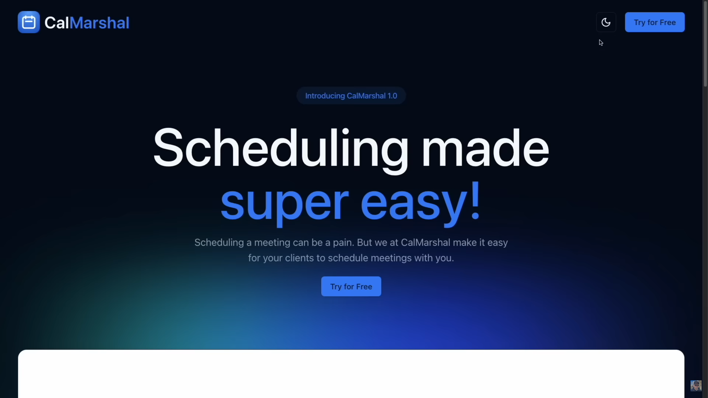

  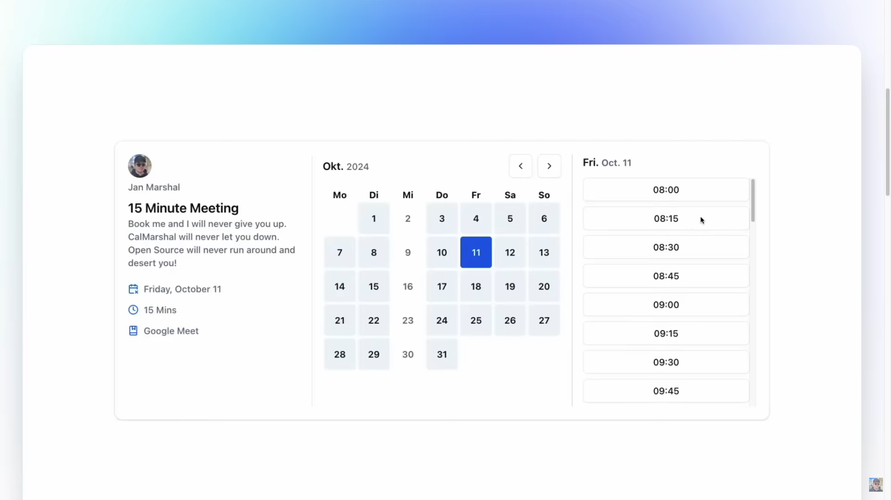

  


### 页面 login

- login

  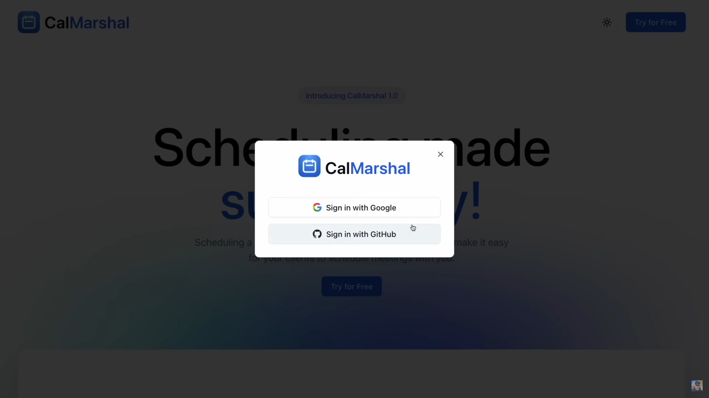

  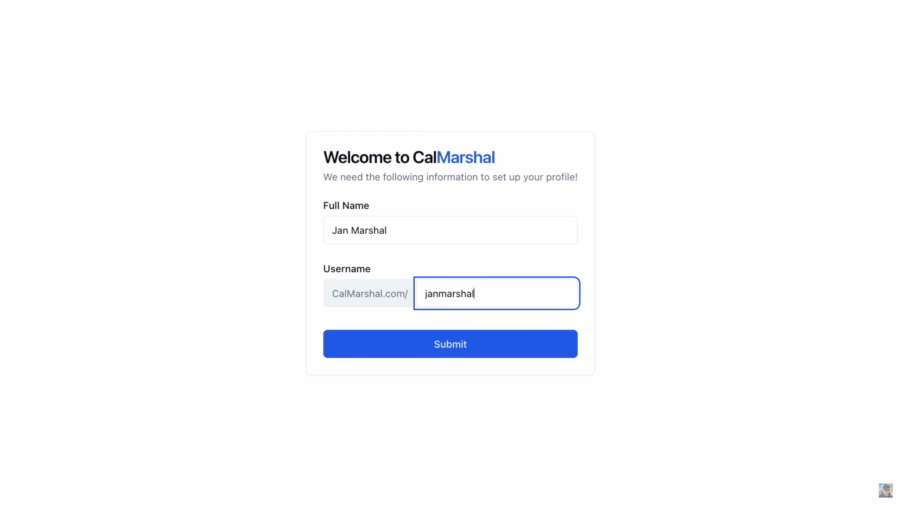

  


### 页面 dashboard event

- event

  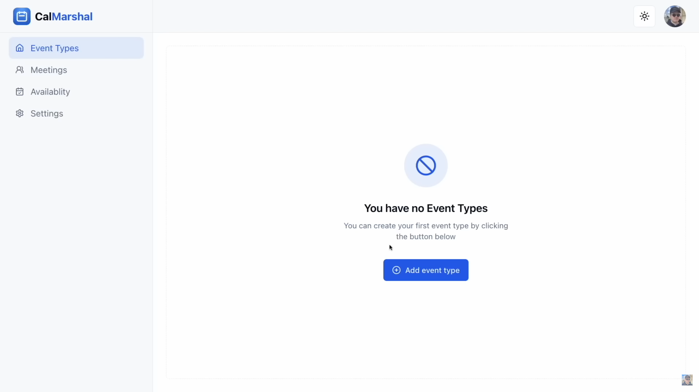

  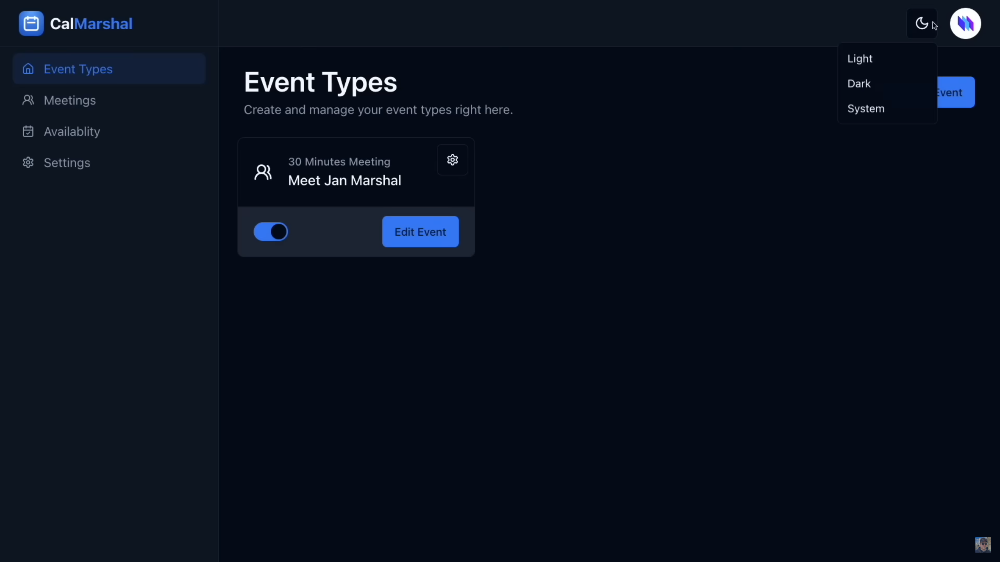
  
  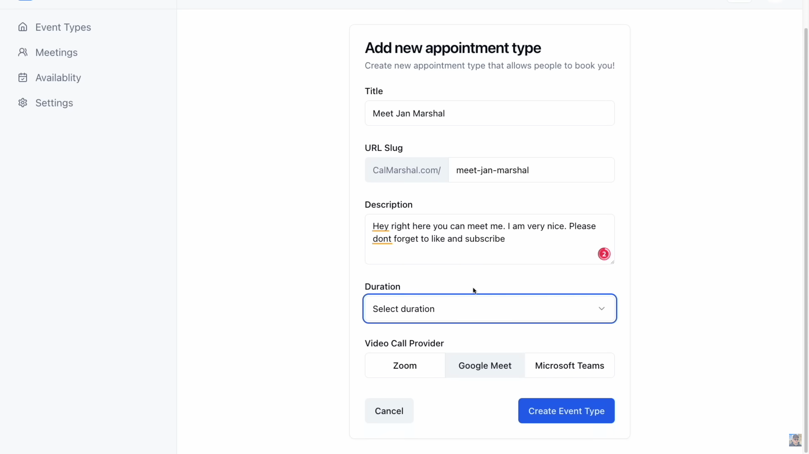
  
  


### 页面 dashboard meetings

- meetings

  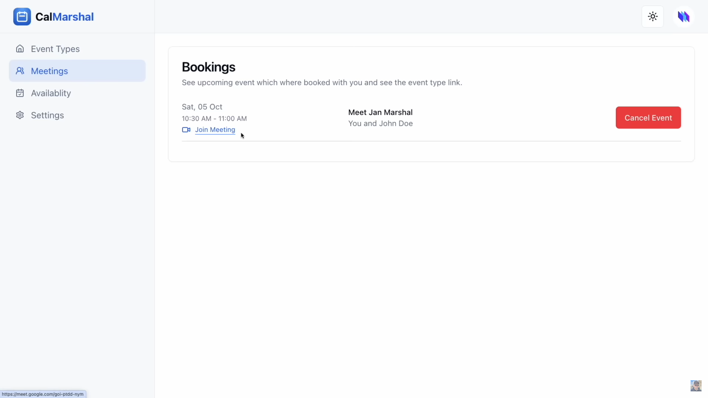

  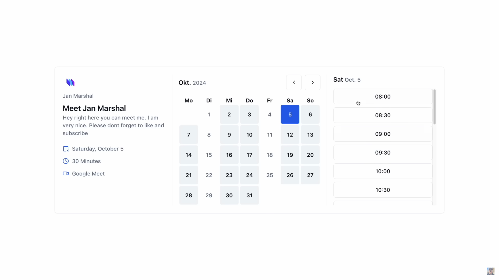

  


### 页面 dashboard availablity

- availablity

  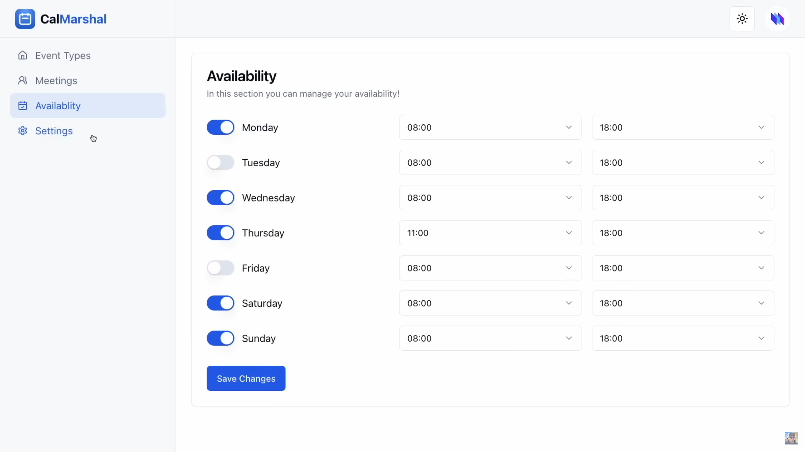

  


### 页面 dashboard settings

- settings

  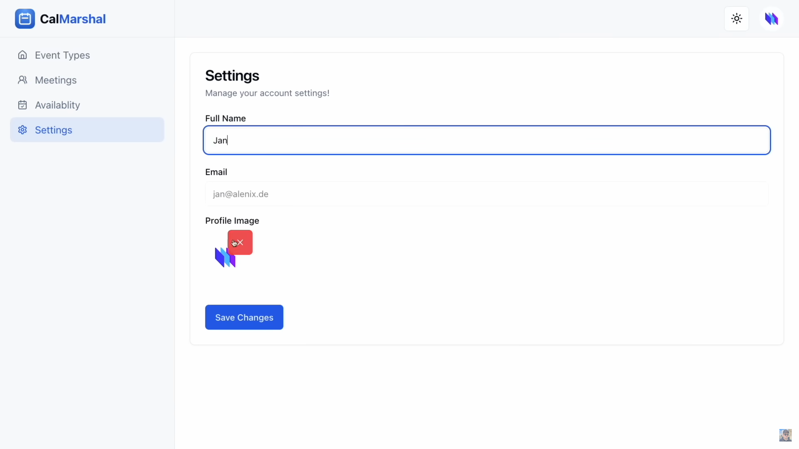

  


## 库表设计 ✔

### 汇总

### model X

### model X


## 接口数据 ✔

### Interface X

### Interface X


## 后端初始化

### 新建项目

- [Supabase](https://supabase.com/)

  ```bash
  ZYGKoZFB8CpzhXkE
  
  ```

  


### 依赖文件


### 配置文件


### 中间件配置

- PostgreSQL

  ```bash
  # win
  mkdir -p /d/module/container/postgresql/data
  docker pull postgres:16-alpine3.19 
  docker run -d \
    --name postgres16 \
    -e POSTGRES_DB=database \
    -e TZ=PRC \
    -e POSTGRES_USER=root \
    -e POSTGRES_PASSWORD=123456 \
    -p 5432:5432 \
    -v D:\\module\\container\\pastgresql\\data:/var/lib/postgresql/data \
    postgres:16-alpine3.19
  
  # ubuntu
  mkdir -p /opt/module/container/postgresql/data
  docker pull postgres:16-alpine3.19 
  docker run -d \
    --name postgres16 \
    -e POSTGRES_DB=database \
    -e TZ=PRC \
    -e POSTGRES_USER=root \
    -e POSTGRES_PASSWORD=123456 \
    -p 5432:5432 \
    -v /opt/module/container/postgresql/data:/var/lib/postgresql/data \
    postgres:16-alpine3.19
  
  
  docker exec -it postgres16 bash
  psql -d database -U root -W  # 123456
  
  ```

  


## 前端初始化

### 新建项目

- 新建项目

  ```bash
  # https://nextjs.org/docs/getting-started/installation
  cd /opt/code/frontend-code/hello-frontend/code-show-project/calendar-scheduling
  npx create-next-app@14.2.13  # calmarshal
  # ts YES  # eslint YES  # tailwind YES  # src NO  # app router YES  # import alias NO
  
  ```
  
  项目结构
  
  ```bash
  calmarshal$ tree -L 2
  .
  ├── README.md
  ├── .gitignore
  │
  ├── node_modules
  ├── package.json
  ├── package-lock.json
  │
  ├── app
  │   ├── favicon.ico
  │   ├── fonts
  │   ├── globals.css			# css 
  │   ├── layout.tsx			# layout ✔
  │   └── page.tsx			# page ✔
  │
  ├── .eslintrc.json			# eslint
  ├── next.config.mjs			# nextjs conf
  ├── next-env.d.ts			# nextjs env
  ├── postcss.config.mjs		# 
  ├── tailwind.config.ts		# tailwind conf
  └── tsconfig.json			# ts conf
  
  ```
  
  


### 依赖配置 Auth.js

- [Auth.js](https://authjs.dev/getting-started/installation?framework=Next.js) 

  ```bash
  # step 1: Installing Auth.js
  npm install next-auth@beta
  
  # step 2: Setup Environment
  npx auth secret
  mv .env.local .env.template && touch .env
  
  # step 3: Configure
  touch auth.ts  # Auth.js
  mkdir -p app/api/auth/[...nextauth] && touch app/api/auth/[...nextauth]/route.ts
  # ./middleware.ts NO  # prisma
  
  
  # step 4: Setup Authentication Methods
  # https://authjs.dev/getting-started/authentication/oauth
  
  # [origin]/api/auth/callback/github
  # https://github.com/settings/applications/new
  # Application name: CalMarshal Locale3001
  # Homepage URL: http://localhost:3001/
  # Authorization callback URL: http://localhost:3001/api/auth/callback/github
  
  # [origin]/api/auth/callback/google
  # https://console.cloud.google.com/projectcreate
  # CalMarshal
  # 
  # https://console.cloud.google.com/apis/credentials?project=calmarshal-locale3001
  # http://localhost:3001/api/auth/callback/google
  
  
  # step 5: Database Adapter (Cookie)
  # https://authjs.dev/getting-started/adapters/prisma
  npm install @prisma/client @auth/prisma-adapter
  npm install prisma --save-dev
  
  ```
  
  .env.template
  
  ```
  
  ```
  
  auth.ts
  
  ```typescript
  import { PrismaAdapter } from "@auth/prisma-adapter";
  import NextAuth from "next-auth";
  import GitHub from "next-auth/providers/github";
  import Google from "next-auth/providers/google";
  import prisma from "./db";
  
  export const { handlers, signIn, signOut, auth } = NextAuth({
    adapter: PrismaAdapter(prisma),
    providers: [GitHub, Google],
  });
  
  ```
  
  app/api/auth/[...nextauth]/route.ts
  
  ```typescript
  import { handlers } from "@/app/lib/auth";
  
  export const { GET, POST } = handlers;
  
  ```
  
  


### 依赖配置 Prisma

- [Prisma nextjs best practices](https://www.prisma.io/docs/orm/more/help-and-troubleshooting/help-articles/nextjs-prisma-client-dev-practices)

  ```bash
  npx prisma init
  touch app/lib/db.ts
  
  npx prisma db push
  
  ```

  prisma/schema.prisma

  ```
  generator client {
    provider = "prisma-client-js"
  }
  
  datasource db {
    provider          = "postgresql"
    url               = env("DATABASE_URL")
    directUrl         = env("DIRECT_URL")
  }
  
  
  model User {
    id            String          @id @default(cuid())
    name          String?
    email         String          @unique
    emailVerified DateTime?
    image         String?
    accounts      Account[]
    sessions      Session[]
   
    createdAt DateTime @default(now())
    updatedAt DateTime @updatedAt
  }
   
  model Account {
    userId            String
    type              String
    provider          String
    providerAccountId String
    refresh_token     String?
    access_token      String?
    expires_at        Int?
    token_type        String?
    scope             String?
    id_token          String?
    session_state     String?
   
    createdAt DateTime @default(now())
    updatedAt DateTime @updatedAt
   
    user User @relation(fields: [userId], references: [id], onDelete: Cascade)
   
    @@id([provider, providerAccountId])
  }
   
  model Session {
    sessionToken String   @unique
    userId       String
    expires      DateTime
    user         User     @relation(fields: [userId], references: [id], onDelete: Cascade)
   
    createdAt DateTime @default(now())
    updatedAt DateTime @updatedAt
  }
   
  model VerificationToken {
    identifier String
    token      String
    expires    DateTime
   
    @@id([identifier, token])
  }
   
  ```

  app/lib/db.ts

  ```typescript
  import { PrismaClient } from "@prisma/client";
  
  // https://www.prisma.io/docs/orm/more/help-and-troubleshooting/help-articles/nextjs-prisma-client-dev-practices
  
  const prismaClientSingleton = () => {
    return new PrismaClient();
  };
  
  declare const globalThis: {
    prismaGlobal: ReturnType<typeof prismaClientSingleton>;
  } & typeof global;
  
  const prisma = globalThis.prismaGlobal ?? prismaClientSingleton();
  export default prisma;
  
  if (process.env.NODE_ENV !== "production") globalThis.prismaGlobal = prisma;
  
  ```

- [Prisma supabase guide](https://supabase.com/partners/integrations/prisma)

  ```
  
  ```

  


### 精简项目

- 精简项目

  ```bash
  mkdir app/dashboard && touch app/dashboard/page.tsx
  touch app/lib/hooks.ts
  mkdir app/components && touch app/components/Navbar.tsx
  
  ```
  
  app/page.tsx
  
  ```tsx
  export default function Home() {
    return (
      <div>
        <h1>Calendar Scheduling</h1>
      </div>
    );
  }
  
  ```
  
  app/layout.tsx
  
  ```tsx
  
  ```
  
  app/globals.css

  ```css
  @tailwind base;
  @tailwind components;
  @tailwind utilities;
  
  ```
  
- 仪表盘

  app/dashboard/page.tsx

  ```tsx
  import { requireUser } from "../lib/hooks";
  
  export default async function DashboardPage() {
    const session = await requireUser();
  
    return (
      <div>
        <h1>Dashboard Page</h1>
      </div>
    );
  }
  
  ```

  app/lib/hooks.ts

  ```typescript
  import { redirect } from "next/navigation";
  import { auth } from "../lib/auth";
  
  // This function checks if the user is logged in or not. If not, it redirects to the login page.
  export async function requireUser() {
    const session = await auth();
  
    if (!session?.user) {
      return redirect("/");
    }
    return session;
  }
  
  ```

  


## 后端接口 XXX

### 逻辑梳理

### 代码生成 MyBatisX


### 数据库访问层 (mapper) ✔

### 业务逻辑层 (service) ✔

### 接口访问层 (controller) ✔


### 数据模型 (model)

### 自定义异常

### 测试接口


## 前端页面 XXX

### 布局

### 页面 X

### 页面 X

### 组件 X

### 组件 X

### 路由配置

### 类型约束


## 前后端联调 XXX

### 前端请求

### 页面 X

### 页面 X


## 项目部署


