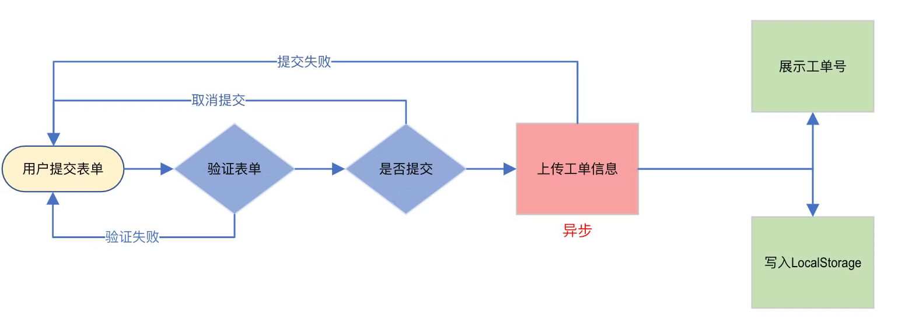
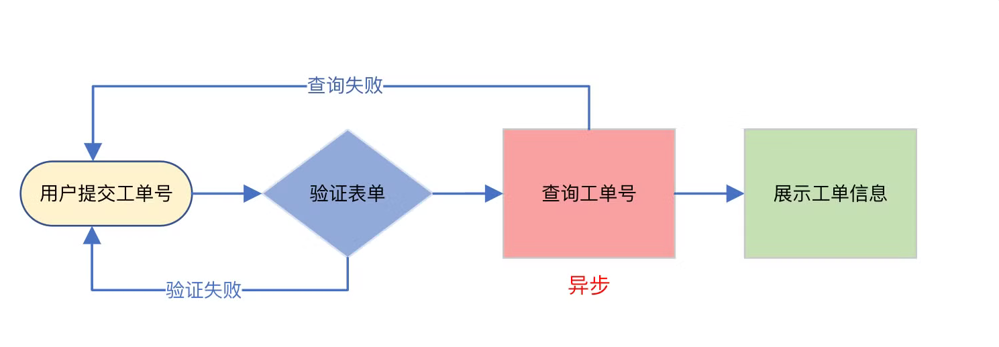
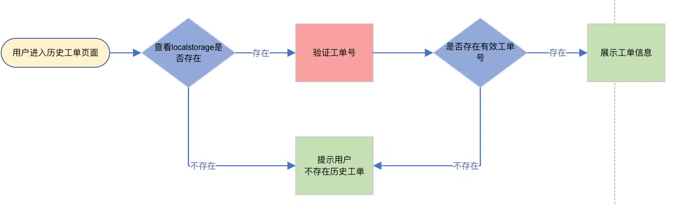

# Hospital Issue System

- Reference

  [github frontend](https://github.com/13RTK/medical-info-trace-vue-page), [github backend](https://github.com/13RTK/medical-info-track), 


## 背景介绍

### 需求分析

- 需求

  医院日常运作 需要向信息科反映问题 某科室硬件有问题

  


### 项目规划


### 技术选型 ✔

- 前端

  vue

- 后端

  nodejs express


### 业务流程

- 核心流程

  用户：工单提交、工单查询、历史工单查询

  管理员和员工：分配工单、员工完成工单、创建新员工

- 用户

  
  
  
  
  


### 功能梳理


### 架构设计 ✔


## 页面设计 ✔

### 页面 X

### 页面 X


## 库表设计 ✔

- sql/db.sql

  ```sql
  -- ---------------------------------------------------
  -- table
  -- ---------------------------------------------------
  -- staff
  DROP TABLE IF EXISTS `staff`;
  CREATE TABLE `staff` (
    `id` int NOT NULL AUTO_INCREMENT,
    `staff_name` varchar(30) COLLATE utf8mb4_unicode_ci NOT NULL,
    `staff_role` enum('admin','staff') CHARACTER SET utf8mb4 COLLATE utf8mb4_unicode_ci DEFAULT 'staff',
    `password` varchar(255) COLLATE utf8mb4_unicode_ci NOT NULL,
    PRIMARY KEY (`id`)
  ) ENGINE=InnoDB AUTO_INCREMENT=6 DEFAULT CHARSET=utf8mb4 COLLATE=utf8mb4_unicode_ci;
  
  -- issue
  DROP TABLE IF EXISTS `issue`;
  CREATE TABLE `issue` (
    `id` int NOT NULL AUTO_INCREMENT,
    `poster` varchar(255) COLLATE utf8mb4_unicode_ci NOT NULL,
    `create_date` datetime NOT NULL,
    `description` varchar(255) CHARACTER SET utf8mb4 COLLATE utf8mb4_unicode_ci NOT NULL,
    `image` varchar(255) CHARACTER SET utf8mb4 COLLATE utf8mb4_unicode_ci,
    `state` enum('wait','fixing','complete') COLLATE utf8mb4_unicode_ci DEFAULT 'wait',
    `fixed_date` datetime DEFAULT NULL,
    `staff_id` int DEFAULT NULL,
    PRIMARY KEY (`id`)
  ) ENGINE=InnoDB AUTO_INCREMENT=21 DEFAULT CHARSET=utf8mb4 COLLATE=utf8mb4_unicode_ci;
  
  -- ---------------------------------------------------
  -- data
  -- ---------------------------------------------------
  -- staff
  insert into staff (staff_name, staff_role, password) values 
  ('张三', 'admin', 'password123'),
  ('李四', 'staff', 'password456'),
  ('王五', 'staff', 'password789'),
  ('赵六', 'admin', 'password000');
  
  -- issue
  insert into issue (poster, create_date, description, image, state, fixed_date, staff_id) values 
  ('张三', '2023-10-01 10:00:00', '厕所水龙头漏水', 'image1.jpg', 'wait', null, null),
  ('李四', '2023-10-22 11:00:00', '病房空调不制冷', 'image2.jpg', 'fixing', null, 101),
  ('王五', '2023-10-30 22:00:00', '走廊灯泡损坏', 'image3.jpg', 'complete', '2023-10-04 14:00:00', 102),
  ('赵六', '2023-11-04 13:00:00', '电梯按钮失灵', 'image4.jpg', 'wait', null, null);
  
  ```

  


### model X


### model X


## 接口数据 ✔

### Interface X

### Interface X


## 前端初始化

### 新建项目

- 新建项目

  ```bash
  cd /opt/code/frontend-code/hello-frontend/code-show-project/hospital-issue-system
  npm create vue@latest  # hospital-issue-vue  # no
  
  npm i
  npm run dev
  
  rm -rf src/components/*
  
  ```

  src/App.vue

  ```vue
  <template></template>
  
  <script></script>
  
  <style></style>
  
  ```

  


### 依赖配置


### 路由配置


## 后端初始化

### 新建项目

- 新建项目

  ```bash
  cd /opt/code/frontend-code/hello-frontend/code-show-project/hospital-issue-system
  mkdir hospital-issue-express && cd hospital-issue-express
  npm init
  
  
  mkdir sql && touch sql/db.sql
  mkdir util && touch util/dbUtil.js util/dateUtil.js
  touch .env config.js
  mkdir model && touch model/issue.js model/staff.js
  touch server.js
  
  ```

  数据库

  ```bash
  docker start mysql57  # 127.0.0.1@3307
  docker exec -it mysql57 bash
  mysql -uroot -p123456
  
  create database hospital;
  use hospital;
  
  ```

  


### 依赖配置

- 依赖配置

  Web Framework: Express(服务器框架), cors(配置跨域)

  ORM / DB: mysql2, [Sequilze](https://www.sequelize.cn/)(类比为Mybatis Plus/JPA)

  开发工具：nodemon(热重载)、morgan(API日志)、multer(文件上传)、moment(时间处理)

  ```bash
  npm install express cors mysql2 sequelize morgan multer dotenv moment nodemon
  
  ```
  
  


---

- 配置信息

  .env

  ```
  LOCAL_DATABASE = hospital
  LOCAL_DB_USERNAME = root
  LOCAL_DB_PASSWORD = 123456
  LOCAL_DB_HOST = 127.0.0.1
  LOCAL_DB_PORT = 3307
  
  SERVER_PORT = 3000
  
  ```

  config.js

  ```js
  import dotenv from "dotenv";
  
  dotenv.config({ path: "./.env" });
  
  export default process.env;
  
  ```

  util/dbUtil.js

  ```js
  // https://www.sequelize.cn/core-concepts/getting-started
  import { Sequelize } from "sequelize";
  import Config from "../config.js";
  
  const {
    LOCAL_DATABASE: database,
    LOCAL_DB_USERNAME: username,
    LOCAL_DB_PASSWORD: password,
    LOCAL_DB_HOST: host,
    LOCAL_DB_PORT: port,
  } = Config;
  
  // connect to mysql
  export const sequelize = new Sequelize(database, username, password, {
    host: host,
    port: port,
    dialect: "mysql",
  });
  
  // // test connection  // node ./util/dbUtil.js
  // try {
  //   await sequelize.authenticate();
  //   console.log("Connection has been established successfully.");
  // } catch (error) {
  //   console.error("Unable to connect to the database:", error);
  // }
  
  ```

- 封装脚本

  package.json

  ```json
  {
    "name": "hospital-issue-express",
    "version": "1.0.0",
    "description": "",
    "main": "index.js",
    "type": "module",
    "scripts": {
      "test": "echo \"Error: no test specified\" && exit 1",
      "start": "nodemon server.js"
    },
    "author": "oswin",
    "license": "ISC",
    "dependencies": {
      "cors": "^2.8.5",
      "dotenv": "^16.4.5",
      "express": "^4.21.0",
      "moment": "^2.30.1",
      "morgan": "^1.10.0",
      "multer": "^1.4.5-lts.1",
      "mysql2": "^3.11.2",
      "nodemon": "^3.1.4",
      "sequelize": "^6.37.3"
    }
  }
  
  ```

- 启动类

  server.js 

  ```js
  
  ```

  


---

- 待重构 服务器启动 + 接口

  server.js 

  ```js
  import cors from "cors";
  import express from "express";
  import morgan from "morgan";
  
  import config from "./config.js";
  import Issue from "./model/issue.js";
  import { convertTimestampToDateTime } from "./util/dateUtil.js";
  
  // app
  const app = express();
  const { SERVER_PORT: port } = config;
  
  // middleware
  app.use(morgan("dev")); // logger
  app.use(cors()); // CORS all
  
  app.use(express.json()); // JSON parser
  app.use(express.urlencoded({ extended: true })); // URL parser
  
  /**
   * 时间戳处理
   */
  app.use((req, _res, next) => {
    req.questTime = Date.now();
    // console.log(req.questTime); // 1726234573060
    // console.log(convertTimestampToDateTime(req.questTime)); // 2024-09-13 21:36:13
    next();
  });
  
  /**
   * 提交工单
   *
   * {
   *  "poster": "oswin",
   *  "description": "haha",
   *  "image": "https://avatars.githubusercontent.com/u/132178516?v=4"
   * }
   */
  app.post("/issue", async (req, res) => {
    // TODO: time format in db
    const createDate = convertTimestampToDateTime(req.questTime); // time
    const { poster, description, image } = req.body; // state 默认值
  
    // 传参非空验证
    if (!poster || !description || !image) {
      let message = "Field Missing: ";
  
      if (!poster) message += "Poster, ";
      if (!description) message += "Description, ";
      if (!image) message += "Image ";
  
      res.status(400).json({
        status: "failed",
        message: `${message}.`,
      });
      return false;
    }
  
    // 提交工单 model
    const result = await Issue.create({
      poster,
      description,
      image,
      createDate, // model/issue.js
      state: "wait",
      fixedDate: null,
      staffId: null,
    });
    // response
    res.status(200).json({
      status: "success",
      data: result,
    });
  });
  
  // app
  app.listen(port, () => {
    console.log(`Server is running on port ${port}`);
  });
  
  ```

  


## 前端页面 医院工单

### 页面和布局

### 组件 X

### 组件 X

### 前端请求


## 后端接口 医院工单

### 逻辑梳理

### 代码生成 MyBatisX


### 数据库访问层 (mapper) ✔

### 业务逻辑层 (service) ✔

### 接口访问层 (controller) ✔


### 数据模型 (model)

- model/issue.js

  ```js
  // https://www.sequelize.cn/core-concepts/model-basics
  import { DataTypes } from "sequelize";
  import { sequelize } from "../util/dbUtil.js";
  
  /*
  CREATE TABLE `issue` (
      `id` int NOT NULL AUTO_INCREMENT,
      `poster` varchar(255) COLLATE utf8mb4_unicode_ci NOT NULL,
      `create_date` datetime NOT NULL,
      `description` varchar(255) CHARACTER SET utf8mb4 COLLATE utf8mb4_unicode_ci NOT NULL,
      `image` varchar(255) CHARACTER SET utf8mb4 COLLATE utf8mb4_unicode_ci,
      `state` enum('wait','fixing','complete') COLLATE utf8mb4_unicode_ci DEFAULT 'wait',
      `fixed_date` datetime DEFAULT NULL,
      `staff_id` int DEFAULT NULL,
      PRIMARY KEY (`id`)
    ) ENGINE=InnoDB AUTO_INCREMENT=21 DEFAULT CHARSET=utf8mb4 COLLATE=utf8mb4_unicode_ci;
  **/
  
  const Issue = sequelize.define(
    "Issue",
    {
      // 在这里定义模型属性
      id: {
        type: DataTypes.INTEGER,
        primaryKey: true,
        autoIncrement: true,
        allowNull: false,
      },
      poster: {
        type: DataTypes.STRING,
        allowNull: false,
      },
      createDate: {
        type: DataTypes.DATE,
        allowNull: false,
        field: "create_date",
      },
      description: {
        type: DataTypes.STRING,
        allowNull: false,
      },
      image: {
        type: DataTypes.STRING,
        allowNull: false,
      },
      state: {
        type: DataTypes.ENUM,
        values: ["wait", "fixing", "complete"],
        allowNull: false,
        defaultValue: "wait",
      },
      fixedDate: {
        type: DataTypes.DATE,
        allowNull: true, // null
        field: "fixed_date",
      },
      staffId: {
        type: DataTypes.INTEGER,
        allowNull: true, // null
        field: "staff_id",
      },
    },
    {
      tableName: "issue", // no issues
      createdAt: false, // no createAt
      updatedAt: false, // no updateAt
    }
  );
  
  // // `sequelize.define` 会返回模型
  // console.log(Issue === sequelize.models.Issue); // true
  
  // // node ./model/issue.js
  // const res = await Issue.findAll();
  // console.log(res[0].dataValues);
  
  export default Issue;
  
  ```

- model/staff.js

  ```js
  // https://www.sequelize.cn/core-concepts/model-basics
  import { DataTypes } from "sequelize";
  import { sequelize } from "../util/dbUtil.js";
  
  /*
  CREATE TABLE `staff` (
    `id` int NOT NULL AUTO_INCREMENT,
    `staff_name` varchar(30) COLLATE utf8mb4_unicode_ci NOT NULL,
    `staff_role` enum('admin','staff') CHARACTER SET utf8mb4 COLLATE utf8mb4_unicode_ci DEFAULT 'staff',
    `password` varchar(255) COLLATE utf8mb4_unicode_ci NOT NULL,
    PRIMARY KEY (`id`)
  ) ENGINE=InnoDB AUTO_INCREMENT=6 DEFAULT CHARSET=utf8mb4 COLLATE=utf8mb4_unicode_ci;
  **/
  
  const Staff = sequelize.define(
    "Staff",
    {
      id: {
        type: DataTypes.INTEGER,
        primaryKey: true,
        autoIncrement: true,
        allowNull: false,
      },
      staffName: {
        type: DataTypes.STRING(30),
        allowNull: false,
        field: "staff_name",
      },
      staffRole: {
        type: DataTypes.ENUM,
        values: ["admin", "staff"],
        defaultValue: "staff",
        allowNull: false,
        field: "staff_role",
      },
      password: {
        type: DataTypes.STRING,
        allowNull: false,
      },
    },
    {
      tableName: "staff",
      createdAt: false,
      updatedAt: false,
    }
  );
  
  // // node ./model/staff.js
  // const results = await Staff.findAll();
  // console.log(results.forEach((result) => console.log(result.dataValues)));
  
  export default Staff;
  
  ```

  


### 自定义异常

### 测试接口


### 工具类

- util/dbUtil.js

  ```js
  
  ```

- util/dateUtil.js

  ```js
  import moment from "moment";
  
  export const convertTimestampToDateTime = (timestamp) => {
    return moment(timestamp).format("YYYY-MM-DD HH:mm:ss");
  };
  
  ```

  


## 项目部署


