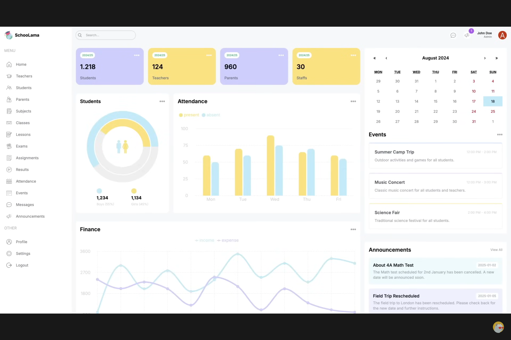
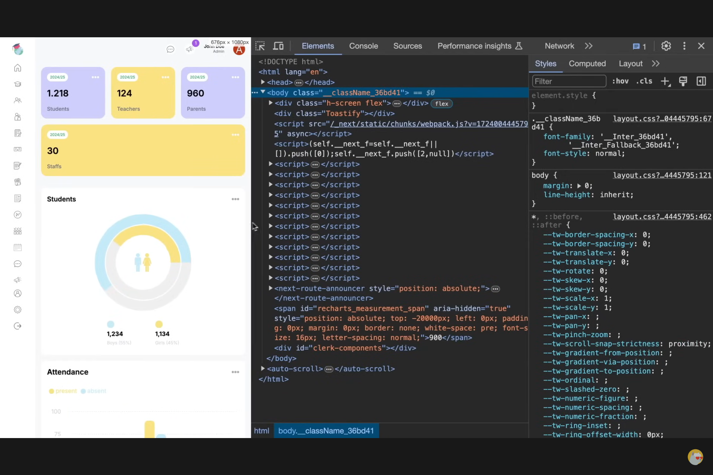
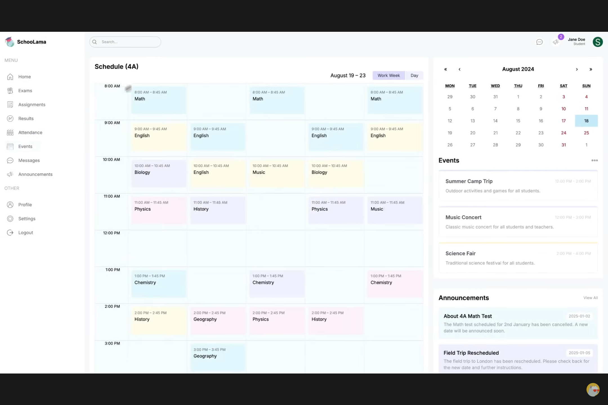
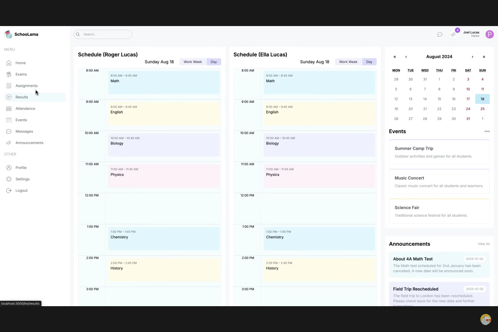
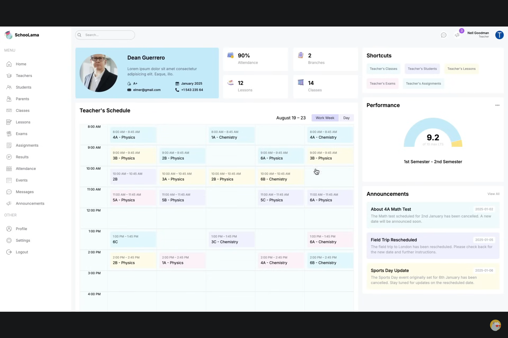

# School Dashboard

- Reference - dev

  [Prisma](https://www.prisma.io/),  [Recharts](https://recharts.org/en-US/), 

- Reference - course

  [Next.js School Management Dashboard UI Design Tutorial | React Next.js Responsive Admin Dashboard](https://www.youtube.com/watch?v=myYlGLFxZas)

  [code start](https://github.com/safak/next-dashboard-ui/tree/starter), [code completed](https://github.com/safak/next-dashboard-ui/tree/completed), [code full-stack-school](https://github.com/safak/full-stack-school), 
  
  


## 背景介绍

### 需求分析

- admin

  

- student

  

- teacher

  

- parent

  


### 项目规划


### 技术选型 ✔

- 前端

  Nextjs, Tailwind

- 后端

  Nextjs, 

  Prisma(ORM), PostgreSQL

- 部署

  


### 业务流程

### 功能梳理

### 架构设计 ✔


## 页面设计 ✔

### 页面 index

- admin

  by date 

  user counts

  components are fully responsive 

  

  

- student

  

- parent

  

- teacher

  

  


### 页面 X


## 库表设计 ✔

### model X

### model X


## 接口数据 ✔

### Interface X

### Interface X


## 前端初始化

### 新建项目

- 新建项目

  ```bash
  # npx create-next-app  # 整合项目 版本问题
  git clone https://github.com/safak/next-dashboard-ui.git  # /tree/starter
  cd next-dashboard-ui/ && rm -rf .git
  #git clone --single-branch -b starter https://github.com/safak/next-dashboard-ui.git
  #git clone --single-branch -b completed https://github.com/safak/next-dashboard-ui.git
  
  npm i
  npm run dev
  
  
  # http://localhost:3000/dashboard/admin
  # http://localhost:3000/admin  # mv src/app/dashboard/ src/app/(dashboard)/
  mkdir src/app/dashboard && touch src/app/dashboard/layout.tsx
  mkdir src/app/dashboard/admin && touch src/app/dashboard/admin/page.tsx
  mkdir src/app/dashboard/student && touch src/app/dashboard/student/page.tsx
  mkdir src/app/dashboard/parent && touch src/app/dashboard/parent/page.tsx
  mkdir src/app/dashboard/teacher && touch src/app/dashboard/teacher/page.tsx
  # http://localhost:3000/sign-in
  mkdir src/app/sign-in && touch src/app/sign-in/page.tsx
  
  # components
  touch src/components/Menu.tsx src/components/NavBar.tsx
  touch src/components/UserCard.tsx src/components/CountChart.tsx src/components/AttendanceChart.tsx src/components/FinanceChart.tsx src/components/EventCalendar.tsx src/components/Announcements.tsx src/components/BigCalender.tsx
  
  ```
  
- tailwind.config.ts (全局主题色)

  ```typescript
  import type { Config } from "tailwindcss";
  
  const config: Config = {
    content: [
      "./src/pages/**/*.{js,ts,jsx,tsx,mdx}",
      "./src/components/**/*.{js,ts,jsx,tsx,mdx}",
      "./src/app/**/*.{js,ts,jsx,tsx,mdx}",
    ],
    theme: {
      extend: {
        backgroundImage: {
          "gradient-radial": "radial-gradient(var(--tw-gradient-stops))",
          "gradient-conic":
            "conic-gradient(from 180deg at 50% 50%, var(--tw-gradient-stops))",
        },
        colors: {
          lamaSky: "#C3EBFA",
          lamaSkyLight: "#EDF9FD",
          lamaPurple: "#CFCEFF",
          lamaPurpleLight: "#F1F0FF",
          lamaYellow: "#FAE27C",
          lamaYellowLight: "#FEFCE8",
        },
      },
    },
    plugins: [],
  };
  export default config;
  
  ```

- src/app/globals.css (全局样式)

  ```css
  @tailwind base;
  @tailwind components;
  @tailwind utilities;
  
  .react-calendar {
    width: 100% !important;
    border: none !important;
    font-family: "Inter", sans-serif !important;
  }
  
  .react-calendar__navigation__label__labelText {
    font-weight: 600;
  }
  
  .react-calendar__title--active {
    background-color: #c3ebfa !important;
    color: black !important;
  }
  
  ```

  


### 依赖配置：recharts

- 图表

  ```bash
  # https://recharts.org/en-US/
  # https://www.npmjs.com/package/react-calendar
  # https://www.npmjs.com/package/react-big-calendar
  npm install recharts \
    react-calendar @types/react-big-calendar moment
  
  ```
  
  


### 路由配置


### 快捷代码 vscode

- typescriptreact.json

  ```json
  {
  	// Place your snippets for typescriptreact here. Each snippet is defined under a snippet name and has a prefix, body and 
  	// description. The prefix is what is used to trigger the snippet and the body will be expanded and inserted. Possible variables are:
  	// $1, $2 for tab stops, $0 for the final cursor position, and ${1:label}, ${2:another} for placeholders. Placeholders with the 
  	// same ids are connected.
  	// Example:
  	// "Print to console": {
  	// 	"prefix": "log",
  	// 	"body": [
  	// 		"console.log('$1');",
  	// 		"$2"
  	// 	],
  	// 	"description": "Log output to console"
  	// }
  	"fcc": {
  		"prefix": "fcc",
  		"body": [
  			"import './${TM_FILENAME_BASE/^(.)/${1:/downcase}/}.css'",
  			"\n",
  			"const ${1:${TM_FILENAME_BASE/(.)(.*)/${1:/capitalize}${2}/}} = () => {",
  			"  return (",
  			"    <div className='${TM_FILENAME_BASE/^(.)/${1:/downcase}/}'>${1:${TM_FILENAME_BASE/(.)(.*)/${1:/capitalize}${2}/}}</div>",
  			"  )",
  			"}",
  			"",
  			"export default ${1:${TM_FILENAME_BASE/(.)(.*)/${1:/capitalize}${2}/}}"
  		],
  		"description": "Create an arrow component with css"
  	},
  	"fcs": {
  		"prefix": "fcs",
  		"body": [
  			"import './${TM_FILENAME_BASE/^(.)/${1:/downcase}/}.scss'",
  			"\n",
  			"function ${1:${TM_FILENAME_BASE/(.)(.*)/${1:/capitalize}${2}/}}(){",
  			"  return (",
  			"    <div className='${TM_FILENAME_BASE/^(.)/${1:/downcase}/}'>${1:${TM_FILENAME_BASE/(.)(.*)/${1:/capitalize}${2}/}}</div>",
  			"  )",
  			"}",
  			"",
  			"export default ${1:${TM_FILENAME_BASE/(.)(.*)/${1:/capitalize}${2}/}}"
  		],
  		"description": "Create a functional component with Sass"
  	},
  	"acs": {
  		"prefix": "acs",
  		"body": [
  			"import './${TM_FILENAME_BASE/^(.)/${1:/downcase}/}.scss'",
  			"\n",
  			"const ${1:${TM_FILENAME_BASE/(.)(.*)/${1:/capitalize}${2}/}} = () => {",
  			"  return (",
  			"    <div className='${TM_FILENAME_BASE/^(.)/${1:/downcase}/}'>${1:${TM_FILENAME_BASE/(.)(.*)/${1:/capitalize}${2}/}}</div>",
  			"  )",
  			"}",
  			"",
  			"export default ${1:${TM_FILENAME_BASE/(.)(.*)/${1:/capitalize}${2}/}}"
  		],
  		"description": "Create an arrow component with Sass"
  	},
  	"comp": {
  		"prefix": "comp",
  		"body": [
  			"const ${1:${TM_FILENAME_BASE/(.)(.*)/${1:/capitalize}${2}/}} = () => {",
  			"  return (",
  			"    <div>${1:${TM_FILENAME_BASE/(.)(.*)/${1:/capitalize}${2}/}}</div>",
  			"  )",
  			"}",
  			"",
  			"export default ${1:${TM_FILENAME_BASE/(.)(.*)/${1:/capitalize}${2}/}}"
  		],
  		"description": "Create a component"
  	},
  	"compt": {
  		"prefix": "compt",
  		"body": [
  			"const ${1:${TM_FILENAME_BASE/(.)(.*)/${1:/capitalize}${2}/}} = () => {",
  			"  return (",
  			"    <div className=''>${1:${TM_FILENAME_BASE/(.)(.*)/${1:/capitalize}${2}/}}</div>",
  			"  )",
  			"}",
  			"",
  			"export default ${1:${TM_FILENAME_BASE/(.)(.*)/${1:/capitalize}${2}/}}"
  		],
  		"description": "Create a component with tailwind classname"
  	}
  }
  ```

  


## 后端初始化

### 新建项目

- 复用前端

  ```bash
  
  ```

  


### 依赖配置：ORM

- 数据库ORM

  ```bash
  npm i prisma  # orm
  npx prisma init  # 初始化  # /prisma/schema.prisma
  
  ```

  schema.prisma

  ```
  generator client {
    provider = "prisma-client-js"
  }
  
  datasource db {
    provider = "postgresql"
    url      = env("DATABASE_URL")
  }
  
  model Admin {
    id       String @id
    username String @unique
  }
  
  model Student {
    id          String       @id
    username    String       @unique
    name        String
    surname     String
    email       String?      @unique
    phone       String?      @unique
    address     String
    img         String?
    bloodType   String
    sex         UserSex
    createdAt   DateTime     @default(now())
    parentId    String
    parent      Parent       @relation(fields: [parentId], references: [id])
    classId     Int
    class       Class        @relation(fields: [classId], references: [id])
    gradeId     Int
    grade       Grade        @relation(fields: [gradeId], references: [id])
    attendances Attendance[]
    results     Result[]
    birthday    DateTime
  }
  
  model Teacher {
    id        String    @id
    username  String    @unique
    name      String
    surname   String
    email     String?   @unique
    phone     String?   @unique
    address   String
    img       String?
    bloodType String
    sex       UserSex
    createdAt DateTime  @default(now())
    subjects  Subject[]
    lessons   Lesson[]
    classes   Class[]
    birthday  DateTime
  }
  
  model Parent {
    id        String    @id
    username  String    @unique
    name      String
    surname   String
    email     String?   @unique
    phone     String    @unique
    address   String
    createdAt DateTime  @default(now())
    students  Student[]
  }
  
  model Grade {
    id    Int @id @default(autoincrement())
    level Int @unique
  
    students Student[]
    classess Class[]
  }
  
  model Class {
    id       Int    @id @default(autoincrement())
    name     String @unique
    capacity Int
  
    supervisorId  String?
    supervisor    Teacher?       @relation(fields: [supervisorId], references: [id])
    lessons       Lesson[]
    students      Student[]
    gradeId       Int
    grade         Grade          @relation(fields: [gradeId], references: [id])
    events        Event[]
    announcements Announcement[]
  }
  
  model Subject {
    id       Int       @id @default(autoincrement())
    name     String    @unique
    teachers Teacher[]
    lessons  Lesson[]
  }
  
  model Lesson {
    id        Int      @id @default(autoincrement())
    name      String
    day       Day
    startTime DateTime
    endTime   DateTime
  
    subjectId   Int
    subject     Subject      @relation(fields: [subjectId], references: [id])
    classId     Int
    class       Class        @relation(fields: [classId], references: [id])
    teacherId   String
    teacher     Teacher      @relation(fields: [teacherId], references: [id])
    exams       Exam[]
    assignments Assignment[]
    attendances Attendance[]
  }
  
  model Exam {
    id        Int      @id @default(autoincrement())
    title     String
    startTime DateTime
    endTime   DateTime
  
    lessonId Int
    lesson   Lesson   @relation(fields: [lessonId], references: [id])
    results  Result[]
  }
  
  model Assignment {
    id        Int      @id @default(autoincrement())
    title     String
    startDate DateTime
    dueDate   DateTime
  
    lessonId Int
    lesson   Lesson   @relation(fields: [lessonId], references: [id])
    results  Result[]
  }
  
  model Result {
    id    Int @id @default(autoincrement())
    score Int
  
    examId       Int?
    exam         Exam?       @relation(fields: [examId], references: [id])
    assignmentId Int?
    assignment   Assignment? @relation(fields: [assignmentId], references: [id])
    studentId    String
    student      Student     @relation(fields: [studentId], references: [id])
  }
  
  model Attendance {
    id      Int      @id @default(autoincrement())
    date    DateTime
    present Boolean
  
    studentId String
    student   Student @relation(fields: [studentId], references: [id])
    lessonId  Int
    lesson    Lesson  @relation(fields: [lessonId], references: [id])
  }
  
  model Event {
    id          Int      @id @default(autoincrement())
    title       String
    description String
    startTime   DateTime
    endTime     DateTime
  
    classId Int?
    class   Class? @relation(fields: [classId], references: [id])
  }
  
  model Announcement {
    id          Int      @id @default(autoincrement())
    title       String
    description String
    date        DateTime
  
    classId Int?
    class   Class? @relation(fields: [classId], references: [id])
  }
  
  enum UserSex {
    MALE
    FEMALE
  }
  
  enum Day {
    MONDAY
    TUESDAY
    WEDNESDAY
    THURSDAY
    FRIDAY
  }
  
  ```

  


## 前端页面 登陆注册

- 布局

  根布局：无

  仪表盘布局：菜单栏、顶部栏、内容

  


### Layout: RootLayout ✔

- src\app\layout.tsx (根布局)

  ```tsx
  import type { Metadata } from "next";
  import { Inter } from "next/font/google";
  import "./globals.css";
  
  const inter = Inter({ subsets: ["latin"] });
  
  export const metadata: Metadata = {
    title: "Lama Dev School Management Dashboard",
    description: "Next.js School Management System",
  };
  
  export default function RootLayout({
    children,
  }: Readonly<{
    children: React.ReactNode;
  }>) {
    return (
      <html lang="en">
        <body className={inter.className}>{children}</body>
      </html>
    );
  }
  
  ```

  


### Page: sign ✔

- 


## 前端页面 仪表盘

### Layout: DashboardLayout ✔

- src/app/(dashboard)/layout.tsx (仪表盘布局)

  Components: Menu, NavBar

  ```tsx
  import Link from "next/link";
  import Image from "next/image";
  import Menu from "@/components/Menu";
  import NavBar from "@/components/NavBar";
  
  export default function DashboardLayout({
    children,
  }: Readonly<{
    children: React.ReactNode;
  }>) {
    return (
      <div className="h-screen flex">
        {/* ========================== LEFT ========================== */}
        <div className="w-[14%] md:w-[8%] lg:w-[16%] xl:w-[14%] p-4">
          <Link
            href="/"
            className="flex items-center justify-center lg:justify-start gap-2"
          >
            <Image src="/logo.png" alt="logo" width={32} height={32} />
            <span className="hidden lg:block font-bold">School Dashboard</span>
          </Link>
  
          <Menu />
        </div>
  
        {/* ========================== RIGHT ========================== */}
        <div className="w-[86%] md:w-[92%] %] lg:w-[84%] xl:w-[86%] bg-[#F7F8FA] overflow-scroll">
          <NavBar />
          {children}
        </div>
      </div>
    );
  }
  
  ```

  


### Components: Menu

- src/components/Menu.tsx 

  根据身份分发菜单
  
  ```tsx
  import { role } from "@/lib/data";
  import Image from "next/image";
  import Link from "next/link";
  
  const menuItems = [
    {
      title: "MENU",
      items: [
        {
          icon: "/home.png",
          label: "Home",
          href: "/",
          visible: ["admin", "teacher", "student", "parent"],
        },
        {
          icon: "/teacher.png",
          label: "Teachers",
          href: "/list/teachers",
          visible: ["admin", "teacher"],
        },
        {
          icon: "/student.png",
          label: "Students",
          href: "/list/students",
          visible: ["admin", "teacher"],
        },
        {
          icon: "/parent.png",
          label: "Parents",
          href: "/list/parents",
          visible: ["admin", "teacher"],
        },
        {
          icon: "/subject.png",
          label: "Subjects",
          href: "/list/subjects",
          visible: ["admin"],
        },
        {
          icon: "/class.png",
          label: "Classes",
          href: "/list/classes",
          visible: ["admin", "teacher"],
        },
        {
          icon: "/lesson.png",
          label: "Lessons",
          href: "/list/lessons",
          visible: ["admin", "teacher"],
        },
        {
          icon: "/exam.png",
          label: "Exams",
          href: "/list/exams",
          visible: ["admin", "teacher", "student", "parent"],
        },
        {
          icon: "/assignment.png",
          label: "Assignments",
          href: "/list/assignments",
          visible: ["admin", "teacher", "student", "parent"],
        },
        {
          icon: "/result.png",
          label: "Results",
          href: "/list/results",
          visible: ["admin", "teacher", "student", "parent"],
        },
        {
          icon: "/attendance.png",
          label: "Attendance",
          href: "/list/attendance",
          visible: ["admin", "teacher", "student", "parent"],
        },
        {
          icon: "/calendar.png",
          label: "Events",
          href: "/list/events",
          visible: ["admin", "teacher", "student", "parent"],
        },
        {
          icon: "/message.png",
          label: "Messages",
          href: "/list/messages",
          visible: ["admin", "teacher", "student", "parent"],
        },
        {
          icon: "/announcement.png",
          label: "Announcements",
          href: "/list/announcements",
          visible: ["admin", "teacher", "student", "parent"],
        },
      ],
    },
    {
      title: "OTHER",
      items: [
        {
          icon: "/profile.png",
          label: "Profile",
          href: "/profile",
          visible: ["admin", "teacher", "student", "parent"],
        },
        {
          icon: "/setting.png",
          label: "Settings",
          href: "/settings",
          visible: ["admin", "teacher", "student", "parent"],
        },
        {
          icon: "/logout.png",
          label: "Logout",
          href: "/logout",
          visible: ["admin", "teacher", "student", "parent"],
        },
      ],
    },
  ];
  
  const Menu = () => {
    return (
      <div className="mt-4 text-sm">
        {menuItems.map((i) => (
          <div className="flex flex-col gap-2" key={i.title}>
            <span className="hidden lg:block text-gray-400 font-light my-4">
              {i.title}
            </span>
            {i.items.map((item) => {
              // Check if the current user has access to the menu item
              if (item.visible.includes(role)) {
                return (
                  <Link
                    href={item.href}
                    key={item.label}
                    className="flex items-center justify-center lg:justify-start gap-4 text-gray-500 py-2 md:px-2 rounded-md hover:bg-lamaSkyLight"
                  >
                    <Image src={item.icon} alt="" width={20} height={20} />
                    <span className="hidden lg:block">{item.label}</span>
                  </Link>
                );
              }
            })}
          </div>
        ))}
      </div>
    );
  };
  
  export default Menu;
  
  ```
  
  


### Components: NavBar

- src/components/NavBar.tsx

  ```tsx
  import Image from "next/image";
  
  const NavBar = () => {
    return (
      <div className="flex items-center justify-between p-4">
        {/* SEARCH BAR */}
        <div className="hidden md:flex items-center gap-2 tex-xs rounded-full ring-[1.5px] ring-grap-300 px-2">
          <Image src="/search.png" alt="" width={14} height={14} />
          <input
            type="text"
            placeholder="Search ..."
            className="w-[200px] p-2 bg-transparent outline-none"
          />
        </div>
  
        {/* ICONS AND USER */}
        <div className="flex items-center gap-6 justify-end w-full">
          <div className="bg-white rounded-full w-7 h-7 flex items-center justify-center cursor-pointer">
            <Image src="/message.png" alt="" width={20} height={20} />
          </div>
  
          <div className="bg-white rounded-full w-7 h-7 flex items-center justify-center cursor-pointer relative">
            <Image src="/announcement.png" alt="" width={20} height={20} />
            <div className="absolute -top-3 -right-3 w-5 h-5 flex items-center justify-center bg-purple-500 text-white rounded-full text-xs">
              1
            </div>
          </div>
  
          <div className="flex flex-col">
            <span className="text-xs leading-3 font-medium">Oswin Oswald</span>
            <span className="text-[10px] text-gray-500 text-right">Admin</span>
          </div>
          <Image
            src="/avatar.png"
            alt=""
            width={36}
            height={36}
            className="rounded-full"
          />
        </div>
      </div>
    );
  };
  
  export default NavBar;
  
  ```

  


### Page: admin ✔

- src/app/dashboard/admin/page.tsx

  Left(Top): UserCard; CountChart + AttendanceChart; FinanceChart

  Right(button): EventCalendar; Announcements

  ```tsx
  import Announcements from "@/components/Announcements";
  import AttendanceChart from "@/components/AttendanceChart";
  import CountChart from "@/components/CountChart";
  import EventCalendar from "@/components/EventCalendar";
  import FinanceChart from "@/components/FinanceChart";
  import UserCard from "@/components/UserCard";
  
  const AdminPage = () => {
    return (
      <div className="p-4 flex gap-4 flex-col md:flex-row">
        {/* ========================== LEFT ========================== */}
        <div className="w-full lg:w-2/3 flex flex-col gap-8">
          {/* USER CARDS */}
          <div className="flex gap-4 justify-between flex-wrap">
            <UserCard type="student" />
            <UserCard type="teacher" />
            <UserCard type="parent" />
            <UserCard type="staff" />
          </div>
  
          {/* CHARTS MIDDLE */}
          <div className="flex gap-4 flex-col lg:flex-row">
            {/* COUNT CHART */}
            <div className="w-full lg:w-1/3 h-[450px]">
              <CountChart />
            </div>
            {/* ATTENDANCE CHART */}
            <div className="w-full lg:w-2/3 h-[450px]">
              <AttendanceChart />
            </div>
          </div>
  
          {/* CHARTS BOTTOM */}
          <div className="w-full h-[500px]">
            <FinanceChart />
          </div>
        </div>
  
        {/* ========================== RIGHT ========================== */}
        <div className="w-full lg:w-1/3 flex flex-col gap-8">
          <EventCalendar />
          <Announcements />
        </div>
      </div>
    );
  };
  
  export default AdminPage;
  
  ```
  
  


### Components: UserCard

- src/components/UserCard.tsx

  ```tsx
  import Image from "next/image";
  
  const UserCard = ({ type }: { type: string }) => {
    return (
      <div className="rounded-2xl odd:bg-lamaPurple even:bg-lamaYellow p-4 flex-1 min-w-[130px]">
        <div className="flex justify-between items-center">
          <span className="text-[10px] bg-white px-2 py-1 rounded-full text-green-600">
            2024.10
          </span>
          <Image src="/more.png" alt="" width={20} height={20} />
        </div>
  
        <h1 className="text-2xl font-semibold my-4">4,356</h1>
        <h2 className="capitalize text-sm font-medium text-gray-500">{type}s</h2>
      </div>
    );
  };
  
  export default UserCard;
  
  ```

  


### Components: CountChart

- src/components/CountChart.tsx

  ```tsx
  "use client";
  
  import Image from "next/image";
  import {
    RadialBarChart,
    RadialBar,
    Legend,
    ResponsiveContainer,
  } from "recharts";
  
  // https://recharts.org/en-US/examples/SimpleRadialBarChart
  
  const data = [
    {
      name: "Total",
      count: 106,
      fill: "white",
    },
    {
      name: "Boys",
      count: 53,
      fill: "#C3EBFA",
    },
    {
      name: "Girls",
      count: 53,
      fill: "#FAE27C",
    },
  ];
  
  const CountChart = () => {
    return (
      <div className="bg-white rounded-xl w-full h-full p-4">
        {/* TITLE */}
        <div className="flex justify-between items-center">
          <h1 className="text-lg font-semibold">Students</h1>
          <Image src="/moreDark.png" alt="" width={20} height={20} />
        </div>
  
        {/* CHART */}
        <div className="relative w-full h-[75%]">
          <ResponsiveContainer>
            <RadialBarChart
              cx="50%"
              cy="50%"
              innerRadius="40%"
              outerRadius="100%"
              barSize={32}
              data={data}
            >
              <RadialBar background dataKey="count" />
            </RadialBarChart>
          </ResponsiveContainer>
          <Image
            src="/maleFemale.png"
            alt=""
            width={50}
            height={50}
            className="absolute top-1/2 left-1/2 -translate-x-1/2 -translate-y-1/2"
          />
        </div>
  
        {/* BOTTOM */}
        <div className="flex justify-center gap-16">
          <div className="flex flex-col gap-1">
            <div className="w-5 h-5 bg-lamaSky rounded-full" />
            <h1 className="font-bold">34,232</h1>
            <h2 className="text-xs text-gray-300">Boys (55%)</h2>
          </div>
          <div className="flex flex-col gap-1">
            <div className="w-5 h-5 bg-lamaYellow rounded-full" />
            <h1 className="font-bold">29,332</h1>
            <h2 className="text-xs text-gray-300">Girls (45%)</h2>
          </div>
        </div>
      </div>
    );
  };
  
  export default CountChart;
  
  ```

  


### Components: AttendanceChart

- src/components/AttendanceChart.tsx

  ```tsx
  "use client";
  
  import Image from "next/image";
  import {
    BarChart,
    Bar,
    Rectangle,
    XAxis,
    YAxis,
    CartesianGrid,
    Tooltip,
    Legend,
    ResponsiveContainer,
  } from "recharts";
  
  // https://recharts.org/en-US/examples/SimpleBarChart
  
  const data = [
    {
      name: "Mon",
      present: 4000,
      absent: 2400,
    },
    {
      name: "Tue",
      present: 3000,
      absent: 1398,
    },
    {
      name: "Wed",
      present: 2000,
      absent: 9800,
    },
    {
      name: "Thu",
      present: 2780,
      absent: 3908,
    },
    {
      name: "Fri",
      present: 1890,
      absent: 4800,
    },
  ];
  
  const AttendanceChart = () => {
    return (
      <div className="bg-white rounded-lg p-4 h-full">
        {/* TITLE */}
        <div className="flex justify-between items-center">
          <h1 className="text-lg font-semibold">Attendance</h1>
          <Image src="/moreDark.png" alt="" width={20} height={20} />
        </div>
  
        {/* CHART */}
        <ResponsiveContainer width="100%" height="90%">
          <BarChart width={500} height={300} data={data} barSize={20}>
            <CartesianGrid strokeDasharray="3 3" vertical={false} stroke="#ddd" />
  
            <XAxis
              dataKey="name"
              axisLine={false}
              tick={{ fill: "#d1d5db" }}
              tickLine={false}
            />
            <YAxis axisLine={false} tick={{ fill: "#d1d5db" }} tickLine={false} />
  
            <Tooltip
              contentStyle={{ borderRadius: "10px", borderColor: "lightgray" }}
            />
            <Legend
              align="left"
              verticalAlign="top"
              wrapperStyle={{ paddingTop: "20px", paddingBottom: "20px" }}
            />
  
            <Bar
              dataKey="present"
              fill="#C3EBFA"
              legendType="circle"
              radius={[10, 10, 0, 0]}
            />
            <Bar
              dataKey="absent"
              fill="#FAE27C"
              legendType="circle"
              radius={[10, 10, 0, 0]}
            />
          </BarChart>
        </ResponsiveContainer>
      </div>
    );
  };
  
  export default AttendanceChart;
  
  ```

  


### Components: FinanceChart

- src/components/FinanceChart.tsx

  ```tsx
  "use client";
  
  import Image from "next/image";
  import {
    LineChart,
    Line,
    XAxis,
    YAxis,
    CartesianGrid,
    Tooltip,
    Legend,
    ResponsiveContainer,
  } from "recharts";
  
  // https://recharts.org/en-US/examples/SimpleLineChart
  
  const data = [
    {
      name: "Jan",
      income: 4000,
      expense: 2400,
    },
    {
      name: "Feb",
      income: 3000,
      expense: 1398,
    },
    {
      name: "Mar",
      income: 2000,
      expense: 9800,
    },
    {
      name: "Apr",
      income: 2780,
      expense: 3908,
    },
    {
      name: "May",
      income: 1890,
      expense: 4800,
    },
    {
      name: "Jun",
      income: 2390,
      expense: 3800,
    },
    {
      name: "Jul",
      income: 3490,
      expense: 4300,
    },
    {
      name: "Aug",
      income: 4000,
      expense: 4700,
    },
    {
      name: "Sep",
      income: 3000,
      expense: 2400,
    },
    {
      name: "Oct",
      income: 2000,
      expense: 1398,
    },
    {
      name: "Nov",
      income: 2780,
      expense: 3908,
    },
    {
      name: "Dec",
      income: 1890,
      expense: 4800,
    },
  ];
  
  const FinanceChart = () => {
    return (
      <div className="bg-white rounded-lg p-4 h-full">
        {/* TITLE */}
        <div className="flex justify-between items-center">
          <h1 className="text-lg font-semibold">Finance</h1>
          <Image src="/moreDark.png" alt="" width={20} height={20} />
        </div>
  
        {/* CHART */}
        <ResponsiveContainer width="100%" height="90%">
          <LineChart
            width={500}
            height={300}
            data={data}
            margin={{
              top: 5,
              right: 30,
              left: 20,
              bottom: 5,
            }}
          >
            <CartesianGrid strokeDasharray="3 3" stroke="#ddd" />
  
            <XAxis
              dataKey="name"
              axisLine={false}
              tick={{ fill: "#d1d5db" }}
              tickLine={false}
              tickMargin={10}
            />
            <YAxis
              axisLine={false}
              tick={{ fill: "#d1d5db" }}
              tickLine={false}
              tickMargin={20}
            />
  
            <Tooltip />
            <Legend
              align="center"
              verticalAlign="top"
              wrapperStyle={{ paddingTop: "10px", paddingBottom: "30px" }}
            />
  
            <Line
              type="monotone"
              dataKey="income"
              stroke="#C3EBFA"
              strokeWidth={5}
            />
            <Line
              type="monotone"
              dataKey="expense"
              stroke="#FAE27C"
              strokeWidth={5}
            />
          </LineChart>
        </ResponsiveContainer>
      </div>
    );
  };
  
  export default FinanceChart;
  
  ```
  
  


### Components: EventCalendar

- src/components/EventCalendar.tsx

  ```tsx
  "use client";
  
  import Image from "next/image";
  import { useState } from "react";
  import Calendar from "react-calendar";
  import "react-calendar/dist/Calendar.css";
  
  // https://www.npmjs.com/package/react-calendar
  
  type ValuePiece = Date | null;
  type Value = ValuePiece | [ValuePiece, ValuePiece];
  
  // TEMPORARY
  const events = [
    {
      id: 1,
      title: "Lorem ipsum dolor",
      time: "12:00 PM - 2:00 PM",
      description: "Lorem ipsum dolor sit amet, consectetur adipiscing elit.",
    },
    {
      id: 2,
      title: "Lorem ipsum dolor",
      time: "12:00 PM - 2:00 PM",
      description: "Lorem ipsum dolor sit amet, consectetur adipiscing elit.",
    },
    {
      id: 3,
      title: "Lorem ipsum dolor",
      time: "12:00 PM - 2:00 PM",
      description: "Lorem ipsum dolor sit amet, consectetur adipiscing elit.",
    },
  ];
  
  const EventCalendar = () => {
    const [value, onChange] = useState<Value>(new Date());
  
    return (
      <div className="bg-white p-4 rounded-md">
        <Calendar locale="en-US" onChange={onChange} value={value} />
  
        <div className="flex items-center justify-between">
          <h1 className="text-xl font-semibold my-4">Events</h1>
          <Image src="/moreDark.png" alt="" width={20} height={20} />
        </div>
  
        <div className="flex flex-col gap-4">
          {events.map((event) => (
            <div
              className="p-5 rounded-md border-2 border-gray-100 border-t-4 odd:border-t-lamaSky even:border-t-lamaPurple"
              key={event.id}
            >
              <div className="flex  items-center justify-between">
                <h1 className="font-semibold text-gray-600">{event.title}</h1>
                <span className="text-gray-300 text-xs">{event.time}</span>
              </div>
              <p className="mt-2 to-gray-400 text-sm">{event.description}</p>
            </div>
          ))}
        </div>
      </div>
    );
  };
  
  export default EventCalendar;
  
  ```

  


### Components: Announcements

- src/components/Announcements.tsx

  ```tsx
  const Announcements = () => {
    return (
      <div className="bg-white p-4 rounded-md">
        <div className="flex items-center justify-between">
          <h1 className="text-xl font-semibold">Announcements</h1>
          <span className="text-xs text-gray-400">View All</span>
        </div>
  
        <div className="flex flex-col gap-4 mt-4">
          {/* Announcement 1 */}
          <div className="bg-lamaSkyLight rounded-md p-4">
            <div className="flex items-center justify-between">
              <h2 className="font-medium">Lorem ipsum dolor sit</h2>
              <span className="text-xs text-gray-400 bg-white rounded-md px-1 py-1">
                2025-01-01
              </span>
            </div>
            <p className="text-sm text-gray-400 mt-1">
              Lorem ipsum dolor sit amet consectetur adipisicing elit. Voluptatum,
              expedita. Rerum, quidem facilis?
            </p>
          </div>
          {/* Announcement 2 */}
          <div className="bg-lamaPurpleLight rounded-md p-4">
            <div className="flex items-center justify-between">
              <h2 className="font-medium">Lorem ipsum dolor sit</h2>
              <span className="text-xs text-gray-400 bg-white rounded-md px-1 py-1">
                2025-01-01
              </span>
            </div>
            <p className="text-sm text-gray-400 mt-1">
              Lorem ipsum dolor sit amet consectetur adipisicing elit. Voluptatum,
              expedita. Rerum, quidem facilis?
            </p>
          </div>
          {/* Announcement 3 */}
          <div className="bg-lamaYellowLight rounded-md p-4">
            <div className="flex items-center justify-between">
              <h2 className="font-medium">Lorem ipsum dolor sit</h2>
              <span className="text-xs text-gray-400 bg-white rounded-md px-1 py-1">
                2025-01-01
              </span>
            </div>
            <p className="text-sm text-gray-400 mt-1">
              Lorem ipsum dolor sit amet consectetur adipisicing elit. Voluptatum,
              expedita. Rerum, quidem facilis?
            </p>
          </div>
        </div>
      </div>
    );
  };
  
  export default Announcements;
  
  ```

  


### Page: student ✔

- src/app/dashboard/student/page.tsx

  Left(Top): BigCalender

  Right(button): EventCalendar; Announcements

  ```tsx
  
  ```

  


### Components: BigCalender

- src/components/BigCalender.tsx

  ```tsx
  
  ```

  


### Page: teacher ✔

- src/app/dashboard/teacher/page.tsx

  ```tsx
  
  ```

  


### Page: parent ✔

- src/app/dashboard/parent/page.tsx

  ```tsx
  
  ```

  


### 前端请求


## 后端接口 XXX

### 逻辑梳理

### 代码生成 MyBatisX


### 数据库访问层 (mapper) ✔

### 业务逻辑层 (service) ✔

### 接口访问层 (controller) ✔


### 数据模型 (model)

### 自定义异常

### 测试接口


## 项目部署


