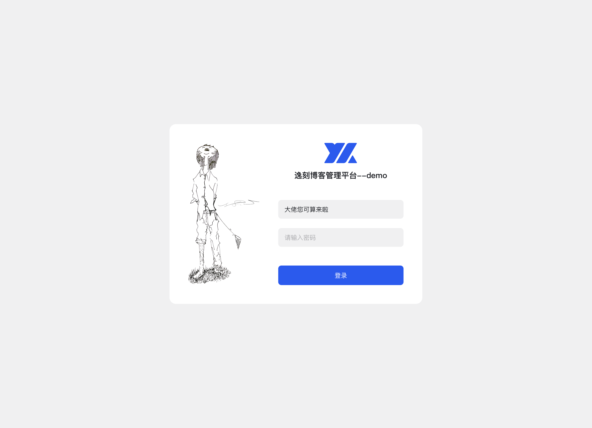
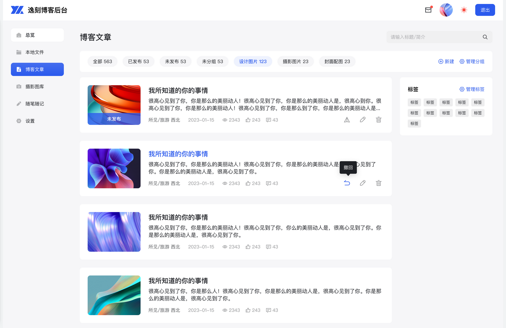
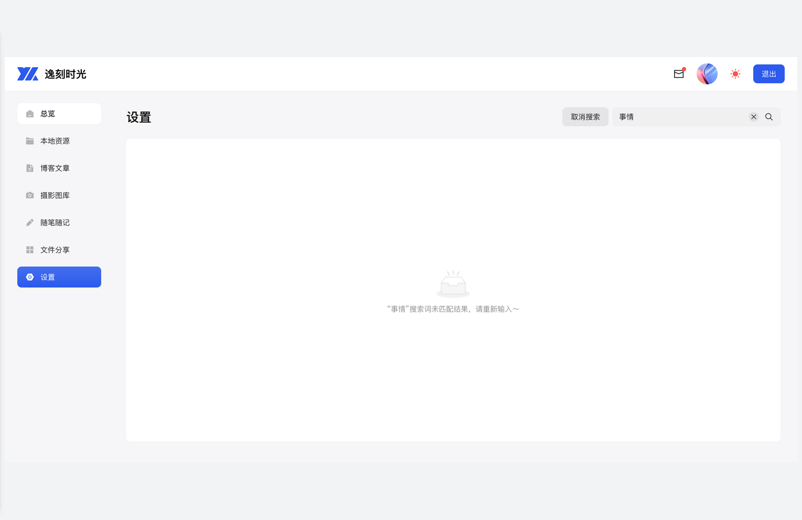
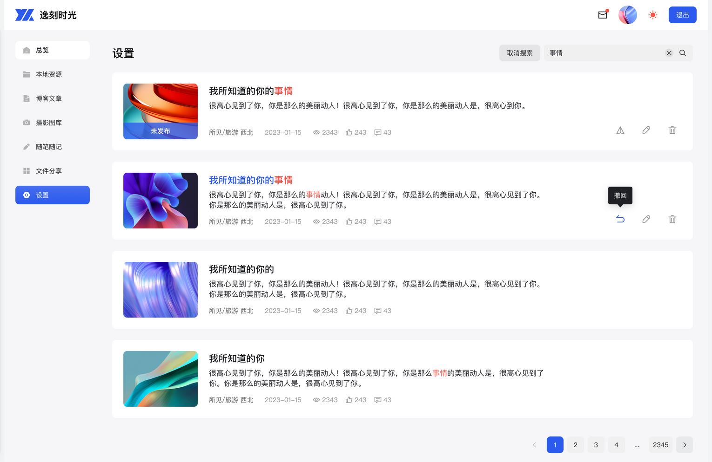
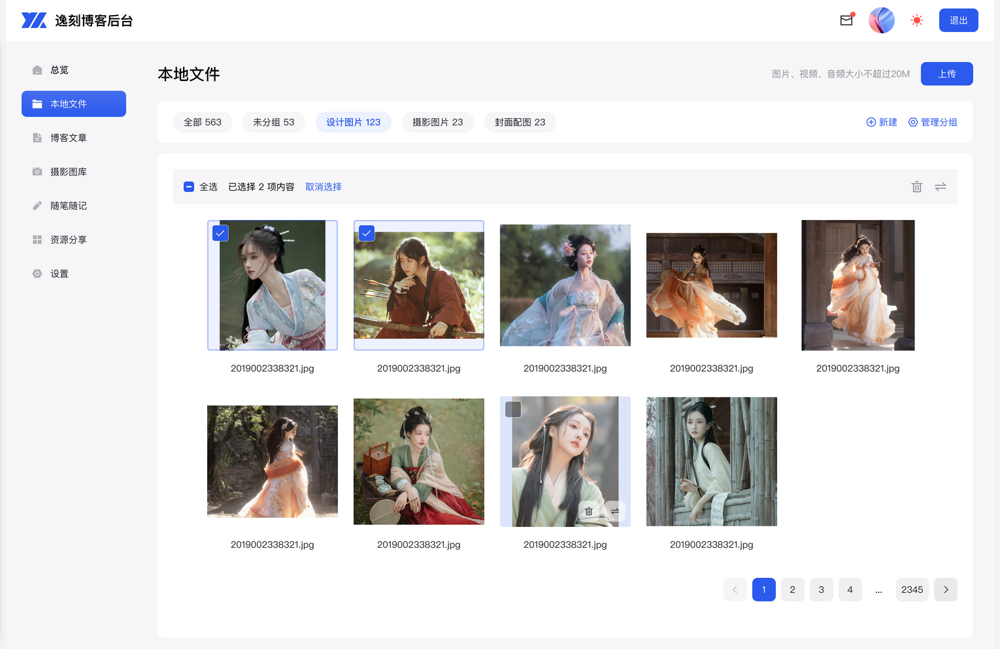
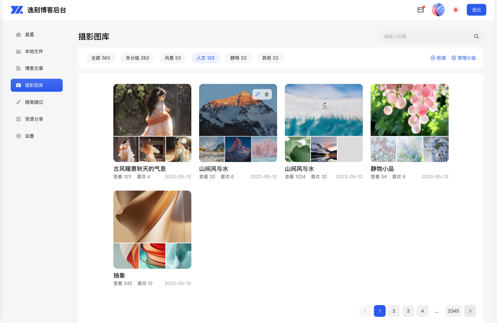
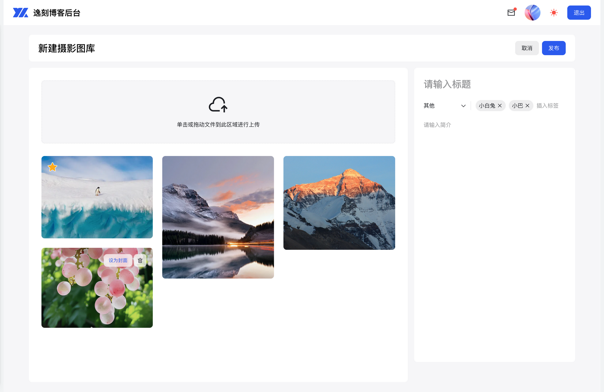

# yike-blog

[TOC]


## 背景介绍

- Reference

  Yike Design : https://yike.design 

  github地址：https://github.com/ecaps1038/yike-design-dev 

  博客管理后台demo: https://www.huohuo90.com:3006 

  个人网站：http://www.huohuo90.com 

  留言墙：https://www.huohuo90.com:3002 

  设计稿地址：https://codesign.qq.com/s/3P04bam21lVbRjn  访问密码：ANOT

  


### 项目规划

- 前台 用户端

- 后台 管理端

  


### 技术选型

- 技术选型

  前端：vue3 + ts + yike design

  后端：nodejs + express

  数据库：mysql


## 页面设计 ✔

- 登陆注册

  用户端登陆

- 前台

  首页

  博客文章、搜索无结果、搜索有结果、新建文章、标签管理

  本地资源、管理图层

  摄影图库、摄影管理、新建摄影

  随记

- 后台

  首页

  


### 登陆注册

- 用户登陆 (前台)

  
  
- 管理员登陆 (后台)

- 用户注册

  


### 前台页面

#### 首页

- 总览

  

  


#### 博客文章 ✔

- 博客文章

  

- 博客文章搜索无结果

  

- 博客文章搜索结果

  

- 新建博客文章

  

  


#### 文章分组+ 文章标签+

- 分组管理

  

- 标签管理

  

  


#### 本地文件

- 本地文件

  

  


#### 摄影图库 ✔

- 摄影图库

  

- 摄影管理

  

- 新建摄影

  

  


#### 随笔随记 ✔

- 随笔随记

  

  


### 后台页面

#### 首页


## 库表设计 ✔

- 用户系统

  todo
  
  


### 信息梳理

- 用户 user

  id、名字、邮箱、密码、头像地址、*创建时间*

- 分类 subset

  id、分类名称、所属类型(0文章 1摄影 2资源)、*创建时间*

- 本地文件 file (图片 音频 视频)

  id、文件地址、文件名称、文件格式、所属分类id、*创建时间*

  


---

- 文章和图库 article 

  id、标题、所属分类id、所属类型(0文章 1摄影)、标签、简介、内容、封面、查看次数、文章状态(0未发布 1已发布)、*创建时间*

- 文章点赞 praise

  id、所属文章id、点赞者id、用户类型(0登陆用户 1游客)、*创建时间*

- 文章评论 comment

  id、所属文章id、评论者id、用户名称、用户类型(0登陆用户 1游客)、*创建时间*、评论内容、举报数、评论是否查看(0未读 1已读)

- 标签 label

  id、标签名称、*创建时间*


---

- 日记 diary

  id、标题、内容、图片、天气id、心情、*创建时间*

- 天气 weather

  id、天气名称、天气图标

- 私信 message

  id、用户id、用户类型(0登陆用户 1游客)、联系方式(user_name)、*创建时间*、内容、是否已读(0未读 1已读)

- 埋点 record

  id、用户id、用户类型(0登陆用户 1游客)、*创建时间*、**访问位置**、访问设备(0移动端 1PC)


### 后端对象

- 后端对象

  ```js
  // #################################################
  // 用户
  // #################################################
  let user = `create table if not exists user(
      id int not null auto_increment,
      name varchar(100) not null comment '用户名',
      mail varchar(100) not null comment '邮箱',
      password varchar(100) not null comment '密码',
      moment varchar(100) not null comment '创建时间',
      imgurl varchar(100) comment '用户头像地址',
      primary key(id)
      )`;
  
  // 分类
  let subset = `create table if not exists subset(
      id int not null auto_increment,
      subset_name varchar(100) not null comment '分类名称',
      classify int not null comment '所属类型(0文章 1摄影 2资源)',
      moment varchar(100) not null comment '创建时间',
      primary key(id)
      )`;
  
  // 文件
  let file = `create table if not exists file(
      id int not null auto_increment,
      url varchar(100) not null comment '文件地址',
      file_name varchar(100) not null comment '文件名称',
      format varchar(32) not null comment '文件格式', 
      subset_id int comment '所属分类id',
      moment varchar(100) not null comment '创建时间',
      primary key(id)
      )`;
  
  // #################################################
  // 文章及图库
  // #################################################
  let article = `create table if not exists article(
      id int not null auto_increment,
      title varchar(200) not null comment '文章标题',
      subset_id int comment '所属分类id',
      classify int not null comment '所属类型(0文章 1摄影)',
      label varchar(200) comment '文章标签',
      brief varchar(1000) comment '文章简介',
      content varchar(5000) comment '文章内容',
      cover varchar(100) comment '文章封面',
      views int default 0 comment '文章查看次数',
      state int default 0 comment '文章状态(0未发布 1已发布)',
      moment varchar(100) not null comment '创建时间',
      primary key(id)
      )`;
  
  // 文章点赞
  let praise = `create table if not exists praise(
      id int not null auto_increment,
      article_id int not null comment '所属文章id',
      user_id int not null comment '点赞者id',
      user_type int not null comment '用户类型(0登陆用户 1游客)',
      moment varchar(100) not null comment '创建时间',
      primary key(id)
      )`;
  
  // 文章评论
  let comment = `create table if not exists comment(
      id int not null auto_increment,
      article_id int not null comment '所属文章id',
      user_id int not null comment '评论者id',
      user_type int not null comment '用户类型(0登陆用户 1游客)',
      moment varchar(100) not null comment '创建时间',
      content varchar(1000) not null comment '评论内容',
      report int default0 comment '举报数',
      isread int default 0 comment '评论是否查看(0未读 1已读)',
      primary key(id)
      )`;
  
  // 标签
  let label = `create table if not exists label(
      id int not null auto_increment,
      label_name varchar(100) not null comment '标签名称',
      moment varchar(100) not null comment '创建时间',
      primary key(id)
      )`;
  
  // #################################################
  // 日记
  // #################################################
  let diary = `create table if not exists diary(
      id int not null auto_increment,
      title varchar(200) not null comment '日记标题',
      content varchar(5000) not null comment '日记内容',
      picture varchar(500) comment '图片地址',
      weather_id int comment '天气id',
      mood int default 0 comment '心情',
      moment varchar(100) not null comment '创建时间',
      primary key(id)
      )`;
  
  // 天气
  let weather = `create table if not exists weather(
      id int not null auto_increment,
      weather_name varchar(100) not null comment '天气名称',
      icon varchar(100) comment '天气图标',
      primary key(id)
      )`;
  
  // 私信
  let message = `create table if not exists message(
      id int not null auto_increment,
      user_id int not null comment '用户id',
      user_type int not null comment '用户类型(0登陆用户 1游客)',
      user_name varchar(100) comment '用户名称 联系方式',
      moment varchar(100) not null comment '创建时间',
      content varchar(1000) not null comment '内容',
      isread int default 0 comment'是否已读(0未读 1已读)',
      primary key(id)
      )`;
  
  // 埋点
  let record = `create table if not exists record(
      id int not null auto_increment,
      user_id int not null comment '用户id',
      user_type int not null comment '用户类型(0登陆用户 1游客)',
      moment varchar(100) not null comment '创建时间',
      position varchar(100) not null comment '访问位置',
      device int not null comment '访问设备(0移动端 1PC)',
      primary key(id)
      )`;
  
  ```

  


### 建表语句

- 环境准备

  ```bash
  
  ```

  


## 接口数据 ✔

### 首页

- 首页用户

  登陆 `/signin`

  总览数据 `/overview`

  访问量 `/visits`

  数据监测 `/survey`

  评论 `/comment`

  私信反馈 `/message`

  ```typescript
  // #################################################
  // 用户登陆
  // /signin
  // #################################################
  
  // 请求
  export type signin = {
    name: string;
    psw: string;
    address: string; // 请求地址
  };
  
  // 响应
  type signinRes = {
    code: number; // 200正常 300为经过token验证 500错误 400功能性拒绝
    data?: {
      id: number;
      name: string;
      imgurl: string; // 后端拼接好
      token: string;
      sex: number;
    };
  };
  
  // #################################################
  // 总览数据
  // /overview
  // #################################################
  
  // 请求
  export type overview = {
    token: string; // 总览不需要携带过多参数 鉴权即可
    userId: string; // 根据不同角色取不同数据
  };
  
  // 响应
  type overviewRes = {
    code: number; // 200正常 300为经过token验证 500错误 400功能性拒绝
    data?: {
      file: string | number; // 本地文件 磁盘大小
      article: number; // 博客文章 文章数量
      gallery: number; // 摄影图库 图片数量
      diary: number; // 随笔随记 随记数量
    };
  };
  
  // #################################################
  // 访问量
  // /visits
  // #################################################
  
  // 请求
  export type visits = {
    token: string;
    length: number; // 时间长度 数据切换
  };
  
  // 响应
  type visitsRes = {
    code: number; // 200正常 300为经过token验证 500错误 400功能性拒绝
    data?: {
      list: [
        {
          date: string; //日期
          count: number; // 访问量
        }
      ];
    };
  };
  
  // #################################################
  // 数据监测
  // /survey
  // #################################################
  
  // 请求
  export type survey = {
    token: string;
    length: number; // 时间长度 数据切换
  };
  
  // 响应
  type surveyRes = {
    code: number; // 200正常 300为经过token验证 500错误 400功能性拒绝
    data?: {
      device: {
        key: "mobile" | "pc"; // 设备类型
        value: number;
      }[];
      website: {
        key: "file" | "article" | "gallery" | "diary"; // 访问子页面
        value: number;
      }[];
    };
  };
  
  // #################################################
  // 评论 (分页查询)
  // /comment
  // #################################################
  
  // 请求
  export type comment = {
    token: string;
    nowPage: number; // 当前页码
    pageSize: number; // 每页数量
    count?: boolean; // 是否获取评论总数量
  };
  
  // 响应
  type commentRes = {
    code: number; // 200正常 300为经过token验证 500错误 400功能性拒绝
    data?: {
      list: [
        {
          id: number;
          article?: {
            id: number;
            title: string;
          };
          user: {
            id: string | number; // 游客string 登陆用户number
            name: string;
            imgurl: string;
          };
          comment: string; // 内容
          moment: string; // 时间
          complaint: number; // 举报数
        }
      ];
      count?: number; // 评论总数量
    };
  };
  
  // #################################################
  // 私信
  // /message
  // #################################################
  
  // 请求
  export type message = {
    token: string;
    nowPage: number; // 当前页码
    pageSize: number; // 每页数量
    count?: boolean; // 是否获取私信总数量
  };
  
  // 响应
  type messageRes = {
    code: number; // 200正常 300为经过token验证 500错误 400功能性拒绝
    data?: {
      list: [
        {
          id: number;
          user: {
            id: string | number; // 游客string 登陆用户number
            name: string;
          };
          message: string; // 内容
          moment: string; // 时间
        }
      ];
    };
  };
  
  ```
  
  
  
  


### 博客文章 ✔

- 博客文章

  文章列表及文章搜索`/article`

  发布文章或撤回文章`changeArticleStatus`

  删除文章`/deleteArticle`

  文章状态`/articleState`

  ```typescript
  // #################################################
  // 文章列表及文章搜索
  // /article
  // #################################################
  
  // 请求
  export type article = {
    token: string;
    nowPage: number; // 当前页码
    pageSize: number; // 每页数量
    status?: number; // 文章状态 已发布 未发布 (默认全部为文章列表)
    subsetId?: number; // 文章分组
    serchTerm?: string | number; // 搜索关键词 (为空则文章列表)
    count?: boolean; // 是否获取文章总数量
  };
  
  // 响应
  type articleRes = {
    code: number; // 200正常 300为经过token验证 500错误 400功能性拒绝
    data?: {
      count?: number; // 总数量
      list: [
        {
          id: number; // 文章id
          title: string; // 文章标题
          subsetId?: number; // 文章分组
          moment: string; // 创建时间
          label?: string[];
          introduce?: string; // 文章简介
          cover?: string; // 文章封面
          views: number; // 文章浏览量
          status: number; // 文章状态 0未发布 1已发布
          comment: number; // 评论数量
          praise: number; // 点赞数量
        }
      ];
    };
  };
  
  // #################################################
  // 发布文章或撤回文章
  // /changeArticleStatus
  // #################################################
  
  // 请求
  export type changeArticleStatus = {
    token: string;
    aricleId: number; // 文章id
  };
  
  // 响应
  type changeArticleStatusRes = {
    code: number; // 200正常 300为经过token验证 500错误 400功能性拒绝
  };
  
  // #################################################
  // 删除文章
  // /deleteArticle
  // #################################################
  
  // 请求
  export type deleteArticle = {
    token: string;
    aricleId: number; // 文章id
  };
  
  // 响应
  type deleteArticleRes = {
    code: number; // 200正常 300为经过token验证 500错误 400功能性拒绝
  };
  
  // #################################################
  // 文章状态 (已发布 未发布)
  // /articleState
  // #################################################
  
  // 请求
  export type articleState = {
    token: string;
  };
  
  // 响应
  type articleStateRes = {
    code: number; // 200正常 300为经过token验证 500错误 400功能性拒绝
    data?: {
      id: number;
      name: "已发布" | "未发布";
      value: number; // 多少条
    }[];
  };
  
  ```
  
  
  
  


### 文章分组+

- 文章分组 +

  分组`/subset`

  新建分组`/addsSubset`

  修改分组`/updateSubset`

  删除分组`/deleteSubset`

  ```typescript
  // #################################################
  // 分组管理
  // /subset
  // #################################################
  
  // 请求
  export type subset = {
    token: string;
    classify: number; // 0文章 1摄影 2资源
  };
  
  // 响应
  type subsetRes = {
    code: number; // 200正常 300为经过token验证 500错误 400功能性拒绝
    data?: {
      count?: number; // 分组总数量
      list: [
        {
          id: number; // 对应删除等操作
          name: string;
          value: number; // 分组文章数量
          moment: number;
        }
      ];
    };
  };
  
  // #################################################
  // 新建分组
  // /addSubset
  // #################################################
  
  // 请求
  export type addSubset = {
    token: string;
    subsetName: string | number;
    classify: number; // 0文章 1摄影 2资源
  };
  
  // 响应
  type addSubsetRes = {
    code: number; // 200正常 300为经过token验证 500错误 400功能性拒绝
  };
  
  // #################################################
  // 修改分组
  // /updateSubset
  // #################################################
  
  // 请求
  export type updateSubset = {
    token: string;
    subsetId: number;
    subsetName: string | number;
  };
  
  // 响应
  type updateSubsetRes = {
    code: number; // 200正常 300为经过token验证 500错误 400功能性拒绝
  };
  
  // #################################################
  // 删除分组
  // /deleteSubset
  // #################################################
  
  // 请求
  export type deleteSubset = {
    token: string;
    subsetId: number;
  };
  
  // 响应
  type deleteSubsetRes = {
    code: number; // 200正常 300为经过token验证 500错误 400功能性拒绝
  };
  
  ```

  

  


### 文章标签+

- 文章标签 +

  标签`/label`

  新建标签`/addLabel`

  删除标签`/deleteLabel`

  ```typescript
  // #################################################
  // 标签管理
  // /label
  // #################################################
  
  // 请求
  export type label = {
    token: string;
  };
  
  // 响应
  type labelRes = {
    code: number; // 200正常 300为经过token验证 500错误 400功能性拒绝
    data?: [
      {
        id: number;
        name: string | number;
        moment: string;
      }
    ];
  };
  
  // #################################################
  // 新建标签
  // /addLabel
  // #################################################
  
  // 请求
  export type addLabel = {
    token: string;
    labelName: string | number;
  };
  
  // 响应
  type addLabelRes = {
    code: number; // 200正常 300为经过token验证 500错误 400功能性拒绝
  };
  
  // #################################################
  // 删除标签
  // /deleteLabel
  // #################################################
  
  // 请求
  export type deleteLabel = {
    token: string;
    labelId: number;
  };
  
  // 响应
  type deleteLabelRes = {
    code: number; // 200正常 300为经过token验证 500错误 400功能性拒绝
  };
  
  ```

  
  


### 本地文件

- 本地文件

  文件`/file`

  上传文件`/uploadFile`

  删除文件`/deleteFile`

  移动文件分类`/removeFile`
  
  ```typescript
  // #################################################
  // 文件
  // /file
  // #################################################
  
  // 请求
  export type file = {
    token: string;
    pageSize: number; // 每页数量
    nowPage: number; // 当前页码
    subsetId?: number; // 分组
    count?: boolean; // 是否获取总数量
  };
  
  // 响应
  export type fileRes = {
    code: number; // 200正常 300为经过token验证 500错误 400功能性拒绝
    data?: {
      count?: number; // 总数量
      list: [
        {
          id: number;
          url: string; // 地址
          fileName: string;
          format: string; // 格式
          subsetId?: number; // 分组所属类型
        }
      ];
    };
  };
  
  // #################################################
  // 上传文件
  // /uploadFile
  // #################################################
  
  // 请求
  export type uploadFile = {
    token: string;
    formData: FormData;
    subsetId?: number; // 分组
  };
  
  // 响应
  export type uploadFileRes = {
    code: number; // 200正常 300为经过token验证 500错误 400功能性拒绝
    data?: {
      id: number;
      url: string; // 地址
      fileName: string;
      format: string; // 格式
      subsetId?: number; // 分组所属类型
    };
  };
  
  // #################################################
  // 文件删除 (单个 多个)
  // /deleteFile
  // #################################################
  
  // 请求
  export type deleteFile = {
    token: string;
    files: number | number[]; // 文件id
  };
  
  // 响应
  export type deleteFileRes = {
    code: number; // 200正常 300为经过token验证 500错误 400功能性拒绝
  };
  
  // #################################################
  // 移动文件分类 (单个 多个; from to)
  // /removeFile
  // #################################################
  
  // 请求
  export type removeFile = {
    token: string;
    files: number | number[]; // 文件id
    subsetId: number; // 分组 to
  };
  
  // 响应
  export type removeFileRes = {
    code: number; // 200正常 300为经过token验证 500错误 400功能性拒绝
  };
  
  ```
  
  
  
  


### 搭建图库 ✔

- 搭建图库

  图片列表及图片搜索`/gallery`

  删除图片`/deleteGallery`

  ```typescript
  // #################################################
  // 图片列表及图片搜索
  // /gallery
  // #################################################
  
  // 请求
  export type gallery = {
    token: string;
    nowPage: number; // 当前页码
    pageSize: number; // 每页数量
    status?: number; // 图片状态 已发布 未发布 (默认全部为图片列表)
    subsetId?: number; // 图片分组
    serchTerm?: string | number; // 搜索关键词 (为空则图片列表)
    count?: boolean; // 是否获取图片总数量
  };
  
  // 响应
  type galleryRes = {
    code: number; // 200正常 300为经过token验证 500错误 400功能性拒绝
    data?: {
      count?: number; // 总数量
      list: [
        {
          id: number; // 图片id
          title: string; // 图片标题
          subsetId?: number; // 图片分组
          moment: string; // 创建时间
          introduce?: string; // 图片简介
          cover?: string; // 图片封面
          content: string; // 文字内容
          views: number; // 图片浏览量
          comment: number; // 评论数量
          praise: number; // 点赞数量
        }
      ];
    };
  };
  
  // #################################################
  // 删除图片
  // /deleteGallery
  // #################################################
  
  // 请求
  type deleteGallery = {
    token: string;
    galleryId: number; // 图片id
  };
  
  // 响应
  type deleteGalleryRes = {
    code: number; // 200正常 300为经过token验证 500错误 400功能性拒绝
  };
  
  ```

  

  


### 随笔随记 ✔

- 随笔随记

  随笔列表及随笔搜索`/diary`

  随笔删除`deleteDiary`

  ```typescript
  // #################################################
  // 随笔列表及随笔搜索
  // /diary
  // #################################################
  
  // 请求
  export type diary = {
    token: string;
    nowPage: number; // 当前页码
    pageSize: number; // 每页数量
    serchTerm?: string | number; // 搜索关键词 (为空则文章列表)
    count?: boolean; // 是否获取文章总数量
  };
  
  // 响应
  type diaryRes = {
    code: number; // 200正常 300为经过token验证 500错误 400功能性拒绝
    data?: {
      count?: number; // 总数量
      list: [
        {
          id: number; // 文章id
          title: string; // 文章标题
          moment: string; // 创建时间
          wealtherId: number; // 天气id
          content: string; // 文字内容
          picture?: string[]; // 图片地址
        }
      ];
    };
  };
  
  // #################################################
  // 随笔删除
  // /deleteDiary
  // #################################################
  
  // 请求
  export type deleteDiary = {
    token: string;
    diaryId: number; // 随笔id
  };
  
  // 响应
  type deleteDiaryRes = {
    code: number; // 200正常 300为经过token验证 500错误 400功能性拒绝
  };
  
  ```

  

  


## 前端初始化

### 新建项目

- 脚手架新建项目 

  [vite](https://vitejs.dev/guide/)

  ```bash
  npm create vite@latest  # blog-frontend  # Vue  # TypeScript
  
  cd blog-frontend
  npm install
  npm run dev
  
  ```

- 安装依赖

  less、[ui组件库](https://yike.design) 

  ```bash
  # less
  npm install less --save-dev
  
  # ui lib
  npm install --save-dev @yike-design/ui
  # plugin ...
  npm install @yike-design/resolver
  
  # 路由
  npm install vue-router@4 --save-dev
  # mock数据
  npm install mockjs --save-dev
  npm install @types/mockjs --save-dev
  # echarts图表
  npm install echarts --save-dev
  
  ```
  
  


#### less test (test x)

- less

  ```vue
  <template>
    <div class="test">test less</div>
  </template>
  
  <style scoped lang="less">
  @color: #00aaee;
  .test {
    color: @color;
  }
  </style>
  
  ```

  


#### yike design (test x)

- 按需引入

  vite.config.ts

  ```typescript
  import { defineConfig } from "vite";
  import vue from "@vitejs/plugin-vue";
  
  import AutoImport from "unplugin-auto-import/vite";
  import Components from "unplugin-vue-components/vite";
  import { YikeResolver } from "@yike-design/resolver"; // https://vitejs.dev/config/ export default
  
  // https://vitejs.dev/config/
  export default defineConfig({
    plugins: [
      vue(),
      AutoImport({ resolvers: [YikeResolver()] }),
      Components({ resolvers: [YikeResolver({ sideEffect: true })] }),
    ],
  
    // css预处理器
    css: {
      preprocessorOptions: {
        less: {
          charset: false,
          additionalData:
            '@import "@yike-design/ui/es/components/styles/basis.less";',
        },
      },
    },
  });
  
  ```

  main.ts

  ```typescript
  import { createApp } from "vue";
  import "./style.css";
  import App from "./App.vue";
  
  import "@yike-design/ui/es/index.less";
  import { YkMessage, YkNotification } from "@yike-design/ui";
  
  const app = createApp(App);
  app.config.globalProperties.$notification = YkNotification;
  app.config.globalProperties.$message = YkMessage;
  app.mount("#app");
  
  ```

  App.vue

  ```vue
  <template>
    <yk-space>
      <yk-button>主要按钮</yk-button>
      <yk-button type="secondary">次要按钮</yk-button>
      <yk-button type="outline">线框按钮</yk-button>
    </yk-space>
    <yk-pagination :total="1000" fix-width></yk-pagination>
  </template>
  
  ```

  


### 路由配置 ✔

#### 路由

- [vue router](https://router.vuejs.org/zh/installation.html)

  [入门使用](https://router.vuejs.org/zh/guide/)、[嵌套路由](https://router.vuejs.org/zh/guide/essentials/nested-routes.html)

  ```bash
  npm install vue-router@4 --save-dev
  
  # 创建路由
  mkdir src/router
  touch src/router/index.ts
  
  
  # 创建页面
  mkdir src/views
  touch src/views/IndexView.vue  # 有菜单
  touch src/views/OverView.vue  # 首页页面
  # 创建组件
  mkdir src/components/bar
  touch src/components/bar/HeadBar.vue
  touch src/components/bar/MenuBar.vue
  touch src/components/bar/TopTitle.vue
  mkdir src/components/overview
  touch src/components/overview/gather.vue
  touch src/components/overview/datas.vue
  mkdir src/components/reply
  touch src/components/reply/index.ts
  touch src/components/reply/comment.vue  # 评论
  touch src/components/reply/information.vue  # 私信
  touch src/components/reply/reply.vue  # 一条信息
  
  # 静态数据
  mkdir src/utils
  touch src/utils/menu.ts
  # mock数据
  mkdir src/mock
  touch src/mock/data.ts
  # echarts图表
  mkdir src/components/echarts
  touch src/components/echarts/index.ts
  touch src/components/echarts/line.vue
  touch src/components/echarts/pie.vue
  
  ```
  
  router/index.ts  [createWebHistory](https://router.vuejs.org/zh/guide/essentials/history-mode.html)
  
  ```typescript
  import { createWebHistory, createRouter } from "vue-router";
  
  import IndexView from "../views/IndexView.vue";
  import Hello from "../components/HelloWorld.vue";
  
  const routes = [
    {
      path: "/",
      component: IndexView,
      redirect: "/overview",
      children: [
        {
          path: "overview",
          component: () => import("../views/OverView.vue"),
        },
        {
          path: "hello",
          component: Hello,
        },
      ],
    },
    {
      path: "/world",
      component: Hello,
    },
  ];
  
  const router = createRouter({
    history: createWebHistory(),
    routes,
  });
  
  export default router;
  
  ```
  
  main.ts
  
  ```typescript
  import { createApp } from "vue";
  import { YkMessage, YkNotification } from "@yike-design/ui";
  import App from "./App.vue";
  import router from "./router";
  import "@yike-design/ui/es/index.less";
  import "./style.less";
  
  const app = createApp(App);
  app.config.globalProperties.$notification = YkNotification;
  app.config.globalProperties.$message = YkMessage;
  
  app.use(router).mount("#app");
  
  ```
  
  


#### 页面

- App.vue

  ```vue
  <template>
    <!-- 顶部导航栏 -->
    <div>顶部导航栏</div>
    <!-- 路由 -->
    <router-view />
  </template>
  ```

- views/IndexView.vue

  ```vue
  <template>
    <!-- 菜单 -->
    <div>菜单</div>
    <!-- 子路由 -->
    <router-view />
  </template>
  
  <script setup lang="ts"></script>
  
  <style scoped lang="less"></style>
  
  ```

- views/OverView.vue

  ```vue
  <template>
    <div>总览</div>
  </template>
  
  <script setup lang="ts"></script>
  
  <style scoped lang="less"></style>
  
  ```

  


## 前台页面

- 主要页面

  **总览页面**：前台首页、*博客页面*、本地资源、*摄影图库*、*随记页面*

  **新建页面**：*新建文章*、*新建摄影*

- 拆分组件

  顶部导航栏：图标、标题；邮箱、头像、主题按钮、退出按钮 (都有 *app.vue*)

  左边菜单栏 (总览页面有 新建页面无)

  标题条：标题组件、搜索栏(可关闭)、支持自定义内容

  总览卡片

  数据统计卡片

  评论和私信

- 拆分组件

  弹窗

  富文本编辑器

  

  

  


### 开发流水线

- 流水线

  src/main.ts -> src/router/index.ts -> src/App.vue

  -> src/views/IndexView.vue -> src/views/OverView.vue

  -> src/components/...

  


### 全局样式

- 清空之前

  ```bash
  rm -rf src/style.css 
  touch src/style.less 
  
  ```

- style.less (main.ts 层叠型样式)

  全局背景、因顶部栏下移

  ```less
  body {
    background-color: @bg-color-m;
  }
  
  #app {
    padding-top: 64px;
  }
  
  ```

  


### 页面组件 ✔

- App.vue

  ```vue
  <template>
    <!-- 顶部导航栏 -->
    <head-bar />
    <!-- 路由 -->
    <router-view />
  </template>
  
  <script setup lang="ts">
  import HeadBar from "./components/bar/HeadBar.vue";
  </script>
  
  <style scoped lang="less"></style>
  
  ```

  views/IndexView.vue

  ```vue
  <template>
    <div class="index-view">
      <!-- 菜单 -->
      <menu-bar />
      <!-- 子路由 -->
      <router-view />
    </div>
  </template>
  
  <script setup lang="ts">
  import MenuBar from "../components/bar/MenuBar.vue";
  </script>
  
  <style scoped lang="less">
  .index-view {
    padding: 32px 32px 32px 232px;
  }
  </style>
  
  ```

  views/OverView.vue

  ```vue
  <template>
    <yk-space dir="vertical" size="xl">
      <!-- 上下结构：标题、总览卡片 -->
      <top-title :is-search="false" />
      <gather />
      <!-- 左右结构：数据统计卡片、评论卡片 -->
      <yk-space style="width: 100%">
        <datas />
        <div class="report" style="background-color: #fff; height: 30px">
          评论
        </div>
      </yk-space>
    </yk-space>
  </template>
  
  <script setup lang="ts">
  import TopTitle from "../components/bar/TopTitle.vue";
  import gather from "../components/overview/gather.vue";
  import datas from "../components/overview/datas.vue";
  </script>
  
  <style scoped lang="less"></style>
  
  ```
  
  


### 组件：HeadBar

- components/HeadBar.vue

  html元素和布局(用间距布局)、css样式、js动态(点击路由首页)

  ```vue
  <template>
    <div class="head-bar">
      <!-- 左边：logo、标题名称 -->
      <yk-space
        align="center"
        :size="12"
        style="cursor: pointer"
        @click="backHome"
      >
        
        <span class="name">Blog oswin</span>
      </yk-space>
  
      <!-- 右边：邮箱、头像、深浅切换、退出按钮 -->
      <yk-space align="center" size="xl">
        <!-- 邮箱 数据展示的徽标 -->
        <yk-badge is-dot>
          <IconEmailFill style="font-size: 20px" />
        </yk-badge>
        <!-- 头像 数据展示 -->
        <yk-avatar
          img-url="https://www.huohuo90.com:3003/user/6353b034dd4b583975e77fbe.png"
        ></yk-avatar>
        <!-- 深浅切换 暗黑模式 -->
        <div><yk-theme /></div>
        <!-- 退出按钮 -->
        <yk-button>退出</yk-button>
      </yk-space>
    </div>
  </template>
  
  <script setup lang="ts">
  import { useRouter } from "vue-router";
  const router = useRouter();
  // 返回总览页面
  const backHome = () => {
    router.push("/");
  };
  </script>
  
  <style scoped lang="less">
  .head-bar {
    position: fixed;
    top: 0;
    left: 0;
    width: 100%;
    height: 64px;
    background: @bg-color-l;
    z-index: 10;
    display: flex; // 一行布局
    justify-content: space-between; // 两边分
    align-items: center; // 上下居中
    padding: 0 @space-xl;
  
    .logo {
      height: 38px;
    }
    .name {
      font-size: 20px;
      font-weight: 600;
    }
  }
  </style>
  
  ```
  
  


### 组件：MenuBar

- components/bar/MenuBar.vue

  html元素和布局、css样式、js动态(点中变色)

  ```typescript
  <template>
    <!-- space 竖排 -->
    <yk-space dir="vertical" class="menu-bar" size="m">
      <!-- 路由跳转 v-for -->
      <router-link
        :to="item.path"
        v-for="item in navLinks"
        :key="item.path"
        class="menu-bar__nav"
      >
        <yk-space align="center" size="m">
          <component :is="item.icon" />
          <yk-text>{{ item.name }}</yk-text>
        </yk-space>
      </router-link>
    </yk-space>
  </template>
  
  <script setup lang="ts">
  import { navLinks } from "../../utils/menu";
  </script>
  
  <style scoped lang="less">
  .menu-bar {
    padding: @space-l;
    position: fixed;
    top: 72px;
    left: 8px;
  
    &__nav {
      width: 160px;
      height: 40px;
      border-radius: @radius-m;
      padding: 0 @space-l;
      display: flex;
      align-items: center; // 上下居中
      text-decoration: none; // 去掉下划线
  
      .yk-icon {
        color: @font-color-ss;
        width: 16px;
        height: 16px;
      }
  
      &:hover {
        // 鼠标悬停
        background: @bg-color-l; // 背景显色
        .yk-text {
          font-weight: 600; // 聚焦字体加粗
        }
      }
    }
    .router-link-active {
      // 被选中
      background: linear-gradient(180deg, #2b5aedde 0%, #2b5aed 100%);
      .yk-icon {
        color: @bg-color-l;
      }
      .yk-text {
        color: @bg-color-l;
        font-weight: 600; // 聚焦字体加粗
      }
    }
  }
  </style>
  
  ```

- utils/menu.ts

  ```typescript
  // #################################################
  // 导航链接
  // #################################################
  export const navLinks = [
    {
      path: "overview",
      name: "总览",
      icon: "IconHomepageOutline",
    },
    {
      path: "localfile",
      name: "本地文件",
      icon: "IconFolderCloseFill",
    },
    {
      path: "article",
      name: "博客文章",
      icon: "IconBookmarkFill",
    },
    {
      path: "gallery",
      name: "摄影图库",
      icon: "IconCameraFill",
    },
    {
      path: "diary",
      name: "随笔随记",
      icon: "IconFillFill",
    },
    {
      path: "setting",
      name: "设置",
      icon: "IconSettingsFill",
    },
  ];
  
  ```
  
  


### 组件：TopTitle

- components/bar/TopTitle.vue

  父子组件通信prop

  ```vue
  <template>
    <div class="top-title">
      <!-- 标题 -->
      <yk-title :level="3" style="margin: 0; line-height: 36px">{{
        props.name
      }}</yk-title>
      <!-- 搜索栏(可关闭) 取消按钮(输入后) v-if v-show-->
      <slot name="custom" />
      <yk-space size="m" v-if="isSearch">
        <yk-button type="secondary" v-show="SearchData" @click="cancelSearch"
          >取消搜索</yk-button
        >
        <yk-input-search
          style="width: 320px"
          placeholder="请输入..."
          v-model="SearchData"
          @search="search"
        >
          <template #suffix>
            <yk-button type="secondary"><IconSearchOutline /></yk-button>
          </template>
        </yk-input-search>
      </yk-space>
    </div>
  </template>
  
  <script setup lang="ts">
  import { ref } from "vue";
  
  // 标题字样 搜索栏 (父子组件通信prop)
  type titleProps = {
    name: string;
    isSearch: boolean;
  };
  const props = withDefaults(defineProps<titleProps>(), {
    name: "总览",
    isSearch: true, // 默认有搜索栏
  });
  
  // 取消按钮(输入后才出现)
  const SearchData = ref();
  
  // 搜索数据
  const emit = defineEmits(["search"]);
  // 搜索事件 搜索数据交给父组件
  const search = () => {
    emit("search", SearchData.value);
  };
  // 取消搜索事件
  const cancelSearch = () => {
    emit("search", "");
    SearchData.value = "";
  };
  </script>
  
  <style scoped lang="less">
  .top-title {
    display: flex; // 一行布局
    align-items: center; // 上下居中
    justify-content: space-between; // 两边分
  }
  </style>
  
  ```

  


### mock数据

- 生成随机数据 拦截ajax请求

  [mockjs](http://mockjs.com/)、[mockjs examples](http://mockjs.com/examples.html#)

  ```bash
  npm install mockjs --save-dev
  npm install @types/mockjs --save-dev
  
  ```

- mock/index.ts

  ```typescript
  import Mock from "mockjs";
  
  // #################################################
  // 总览数据
  // /overview
  // #################################################
  
  // 随机数 浮点数
  const Random = Mock.Random;
  
  export const overview = Mock.mock({
    code: 200,
    data: {
      file: Random.float(60, 100, 2, 2) + "M",
      "article|0-50": 0,
      "gallery|0-50": 0,
      "diary|0-50": 0,
    },
  });
  
  // #################################################
  // 访问量
  // /visits
  // #################################################
  
  export const visits = Mock.mock({
    code: 200,
    "data|30": [
      {
        date: "@datetime('MM-dd')",
        "count|10-100": 12,
      },
    ],
  });
  
  // #################################################
  // 数据监测
  // /survey
  // #################################################
  
  export const survey = Mock.mock({
    code: 200,
    data: {
      device: [
        {
          key: "mobile",
          name: "移动端",
          "value|30-120": 50,
        },
        {
          key: "pc",
          name: "PC端",
          "value|30-120": 40,
        },
      ],
      website: [
        {
          key: "file",
          name: "文件",
          "value|30-120": 50,
        },
        {
          key: "article",
          name: "文章",
          "value|30-120": 50,
        },
        {
          key: "gallery",
          name: "图库",
          "value|30-120": 50,
        },
        {
          key: "diary",
          name: "日记",
          "value|30-120": 50,
        },
      ],
    },
  });
  
  ```

  


### 组件：gather

- components/overview/gather.vue

  挂载获取的数据

  ```vue
  <template>
    <yk-space class="gather">
      <div
        v-for="(item, index) in gathers"
        :key="index"
        class="gather__list"
        :style="{
          background: 'linear-gradient(' + item.bgColor + ')',
        }"
      >
        <!-- 四个小卡片 每个卡片内部是左右结构 左边是文字和数字 -->
        <yk-space dir="vertical" size="s">
          <yk-text type="secondary">{{ item.name }}</yk-text>
          <yk-title :level="2" style="margin: 0">{{ item.total }}</yk-title>
        </yk-space>
        <!-- 右边是按钮 排除第0个 加号正方形次要按钮 -->
        <yk-button v-if="index > 0" size="xl" type="secondary" shape="square">
          <IconPlusOutline />
        </yk-button>
      </div>
    </yk-space>
  </template>
  
  <script setup lang="ts">
  import { ref, onMounted } from "vue";
  import { overLink } from "../../utils/menu";
  import { overview } from "../../mock/data";
  
  // 把静态数据变动态
  const gathers = ref(overLink);
  
  // 获取mock数据
  const drawGatherData = () => {
    let data = overview.data;
    gathers.value[0].total = data.file;
    gathers.value[1].total = data.article;
    gathers.value[2].total = data.gallery;
    gathers.value[3].total = data.diary;
  };
  // 挂载后获取数据
  onMounted(() => {
    drawGatherData();
  });
  </script>
  
  <style scoped lang="less">
  .gather {
    width: 100%;
  
    &__list {
      width: 25%;
      background: #eee;
      display: flex; // 一行布局
      justify-content: space-between; // 两边分
      align-items: center; // 上下居中
      padding: @space-xl;
      border-radius: @radius-m;
  
      &:first-child {
        .yk-title,
        .yk-text {
          color: @white;
        }
      }
    }
  }
  </style>
  
  ```

- utils/menu.ts

  ```typescript
  // #################################################
  // 总览卡片
  // #################################################
  export const overLink = [
    {
      path: "",
      name: "本地文件",
      total: "0M",
      bgColor: "180deg, #2b5aedcc 0%, #2B5AED 100%",
    },
    {
      path: "editarticle",
      name: "博客文章",
      total: 0,
      bgColor: "180deg, #ff600829 0%, #ff60083d 100%",
    },
    {
      path: "editgallery",
      name: "摄影图库",
      total: 0,
      bgColor: "180deg, #25df0629 0%, #25df063d 100%",
    },
    {
      path: "editdiary",
      name: "随笔随记",
      total: 0,
      bgColor: "180deg, #00c9f529 0%, #00c9f53d 100%",
    },
  ];
  
  ```

  


### 组件：datas

- components/overview/datas.vue

  ```vue
  <template>
    <!-- 上下结构 两张卡片 -->
    <yk-space dir="vertical" size="xl" style="width: 50%">
      <div class="data-card">
        <!-- 左右结构：标题、按钮组 -->
        <div class="data-card__title">
          <p class="data-card__title-name">访问量</p>
          <yk-radio-group
            v-model="visitsRadio"
            type="button"
            :solid="true"
            @change="getVisits"
          >
            <yk-radio value="week">近一周</yk-radio>
            <yk-radio value="moon">近一月</yk-radio>
          </yk-radio-group>
        </div>
        <!-- 折线图 -->
        <LineChart chart-height="208px" :data="visitsData" />
      </div>
  
      <div class="data-card">
        <div class="data-card__title">
          <!-- 左右结构：标题、按钮组 -->
          <p class="data-card__title-name">数据监测</p>
          <yk-radio-group v-model="surveyRadio" type="button" :solid="true">
            <yk-radio value="week">近一周</yk-radio>
            <yk-radio value="moon">近一月</yk-radio>
          </yk-radio-group>
        </div>
        <!-- 饼图 -->
        <div style="display: flex">
          <PieChart
            title="设备总数"
            chart-height="208px"
            :data="survey.data.device"
          />
          <PieChart
            title="访问总数"
            chart-height="208px"
            :data="survey.data.website"
          />
        </div>
      </div>
    </yk-space>
  </template>
  
  <script setup lang="ts">
  import { ref, onMounted } from "vue";
  import { LineChart, PieChart } from "../echarts/index";
  import { visits, survey } from "../../mock/index";
  
  // 选项：近一周 近一月
  const visitsRadio = ref("week");
  const surveyRadio = ref("moon");
  
  // 数据：访问量 (动态获取)
  const visitsData = ref([]);
  const getVisits = (e: string) => {
    let data = visits.data;
    if (e == "week") {
      data = data.slice(0, 7);
    }
    visitsData.value = data;
  };
  
  // 挂载时获取数据
  onMounted(() => {
    getVisits(visitsRadio.value);
  });
  </script>
  
  <style scoped lang="less">
  .data-card {
    padding: @space-xl;
    border-radius: @radius-m;
    background: @bg-color-l;
    width: 100%;
    padding-bottom: @space-l;
  
    &__title {
      display: flex; // 一行布局
      justify-content: space-between; // 两边分
      align-items: center; // 上下居中
  
      &-name {
        .font-l();
        font-weight: 600;
        color: font-color-l;
      }
    }
  }
  </style>
  
  ```

  


### echarts图表

- echarts

  [echarts](https://echarts.apache.org/zh/index.html)、[echarts docs](https://echarts.apache.org/handbook/zh/basics/import)

  [echarts examples](https://echarts.apache.org/examples/zh/index.html)、[line-smooth](https://echarts.apache.org/examples/zh/editor.html?c=line-smooth)

  ```bash
  npm install echarts --save-dev
  
  ```

- components/echarts/index.ts

  ```typescript
  import LineChart from "./line.vue";
  import PieChart from "./pie.vue";
  
  export { LineChart, PieChart };
  
  ```

  


### echarts图表：折线图

- components/echarts/line.vue

  ```vue
  <template>
    <div ref="chart" :style="{ height: chartHeight }" class="chart"></div>
  </template>
  
  <script setup lang="ts">
  import { ref, onMounted, onBeforeUnmount, markRaw, watch } from "vue";
  // 引入echarts核心
  import * as echarts from "echarts/core";
  // 引入提示框 标题 直角坐标系 数据集 内置数据转换器组件
  import {
    TitleComponent,
    TooltipComponent,
    GridComponent,
    LegendComponent,
    DatasetComponent,
    TransformComponent,
  } from "echarts/components";
  // 引入折线图 饼图
  import { LineChart } from "echarts/charts";
  // 引入标签自动布局 全局过渡动画等特性
  import { LabelLayout, UniversalTransition } from "echarts/features";
  // 引入canvas渲染器 或SVGRenderer  must!!
  import { CanvasRenderer } from "echarts/renderers";
  
  // 注册组件
  echarts.use([
    TitleComponent,
    TooltipComponent,
    GridComponent,
    LegendComponent,
    DatasetComponent,
    TransformComponent,
    LineChart,
    LabelLayout,
    UniversalTransition,
    CanvasRenderer,
  ]);
  
  // 父子组件数据传递
  const props = defineProps(["data", "chartHeight"]);
  // 获取html元素
  const chart = ref<HTMLDivElement>();
  // 初始化数据
  let myChart = ref();
  const xAixisD = ref<string[]>([]);
  const seriesD = ref<number[]>([]);
  const option = ref();
  
  // 武装数据
  const visit = (e: any) => {
    xAixisD.value = [];
    seriesD.value = [];
    for (let i = 0; i < e.length; i++) {
      xAixisD.value.push(e[i].date); // x数据
      seriesD.value.push(e[i].count); // y数据
    }
    option.value = {
      color: ["#2B5AED"],
      grid: {
        top: "4%",
        left: "0%",
        right: "0%",
        bottom: "0%",
        containLabel: true,
      },
      xAxis: {
        type: "category",
        data: xAixisD.value,
      },
      yAxis: {
        type: "value",
      },
      series: [
        {
          data: seriesD.value,
          type: "line",
          smooth: true,
        },
      ],
    };
  };
  
  // 挂载 实时变化
  onMounted(() => {
    visit(props.data);
  
    myChart.value = markRaw(echarts.init(chart.value as HTMLDivElement));
    myChart.value.setOption(option.value);
  
    // 监听页面视图变化echarts图的宽度
    window.addEventListener("resize", () => {
      myChart.value.resize();
    });
  });
  watch(
    () => props.data,
    (n) => {
      visit(n);
      myChart.value = markRaw(echarts.init(chart.value as HTMLDivElement));
      myChart.value.setOption(option.value);
    }
  );
  
  // 组件销毁前must取消监听事件 否则影响性能和占用内存
  onBeforeUnmount(() => {
    window.removeEventListener("resize", () => {
      myChart.value.resize();
    });
  });
  </script>
  
  <style scoped lang="less">
  .chart {
    width: 100%;
  }
  </style>
  
  ```

  


### echarts图表：饼图

- components/echarts/pie.vue

  ```vue
  <template>
    <div ref="chart" :style="{ height: chartHeight }" class="chart"></div>
  </template>
  
  <script setup lang="ts">
  import { ref, onMounted, onBeforeUnmount, markRaw, watch } from "vue";
  // 引入echarts核心
  import * as echarts from "echarts/core";
  // 引入提示框 标题 直角坐标系 数据集 内置数据转换器组件
  import {
    TitleComponent,
    TooltipComponent,
    GridComponent,
    LegendComponent,
    DatasetComponent,
    TransformComponent,
  } from "echarts/components";
  // 引入折线图 饼图
  import { PieChart } from "echarts/charts";
  // 引入标签自动布局 全局过渡动画等特性
  import { LabelLayout, UniversalTransition } from "echarts/features";
  // 引入canvas渲染器 或SVGRenderer  must!!
  import { CanvasRenderer } from "echarts/renderers";
  
  // 注册组件
  echarts.use([
    TitleComponent,
    TooltipComponent,
    GridComponent,
    LegendComponent,
    DatasetComponent,
    TransformComponent,
    PieChart,
    LabelLayout,
    UniversalTransition,
    CanvasRenderer,
  ]);
  
  // 父子组件数据传递
  const props = defineProps(["data", "title", "chartHeight"]);
  // 获取html元素
  const chart = ref<HTMLDivElement>();
  // 初始化数据
  let myChart = ref();
  const option = ref();
  
  // 武装数据
  const survey = (e: any) => {
    // 饼图中心：总数计算
    let total: number = 0;
    for (let i = 0; i < e.length; i++) {
      total += e[i].value;
    }
  
    option.value = {
      // 饼图的环颜色
      color: ["#2B5AED", "#FA5247", "#1ccbb6", "#F625AF", "#FFB435"],
      // 饼图中心：主标题 副标题
      title: {
        text: total, // 主标题文本
        subtext: props.title, // 副标题文本
        left: "center",
        top: "34%",
        textStyle: {
          fontSize: 32,
          color: "#686B73",
          algin: "center",
        },
        subtextStyle: {
          fontSize: 14,
          color: "#686B73",
        },
      },
  
      // 提示框
      tooltip: {
        trigger: "item",
      },
      // 图例
      legend: {
        show: false,
        // orient: "vertical",
        bottom: 0,
        // right: 0,
        icon: "circle",
      },
  
      series: [
        {
          // name: "设备总数",
          type: "pie",
          radius: ["60%", "76%"],
          avoidLabelOverlap: true,
  
          label: {
            normal: {
              show: true, // 默认显示关闭 若为true则数据重叠
            },
            emhasis: {
              show: true,
            },
          },
          emphasis: {
            label: {
              show: true,
              fontSize: 40,
              fontWeight: "bold",
            },
          },
          labelLine: {
            show: false,
          },
          data: e,
        },
      ],
    };
  };
  survey(props.data);
  
  // 挂载 实时变化
  onMounted(() => {
    myChart.value = markRaw(echarts.init(chart.value as HTMLDivElement));
    myChart.value.setOption(option.value);
  
    // 监听页面视图变化echarts图的宽度
    window.addEventListener("resize", () => {
      myChart.value.resize();
    });
  });
  watch(
    () => props.data,
    (n) => {
      survey(n);
      myChart.value = markRaw(echarts.init(chart.value as HTMLDivElement));
      myChart.value.setOption(option.value);
    }
  );
  
  // 组件销毁前must取消监听事件 否则影响性能和占用内存
  onBeforeUnmount(() => {
    window.removeEventListener("resize", () => {
      myChart.value.resize();
    });
  });
  </script>
  
  <style scoped lang="less">
  .chart {
    width: 100%;
  }
  </style>
  
  ```

  


### 组件：评论和私信

- components/reply/index.ts

  ```typescript
  import comment from "./comment.vue";
  import information from "./information.vue";
  
  export { comment, information };
  
  ```

- components/reply/reply.vue

  ```vue
  
  ```

  


### 组件：评论

- components/reply/comment.vue

  ```vue
  
  ```

  


### 组件：私信

- src/components/reply/information.vue

  ```vue
  
  ```

  


