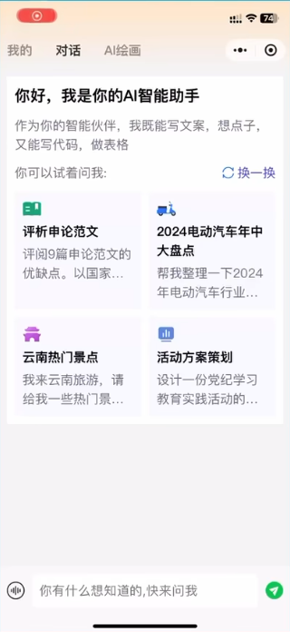
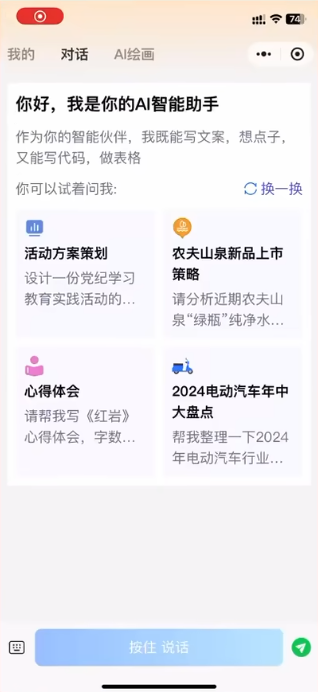
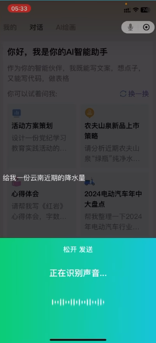
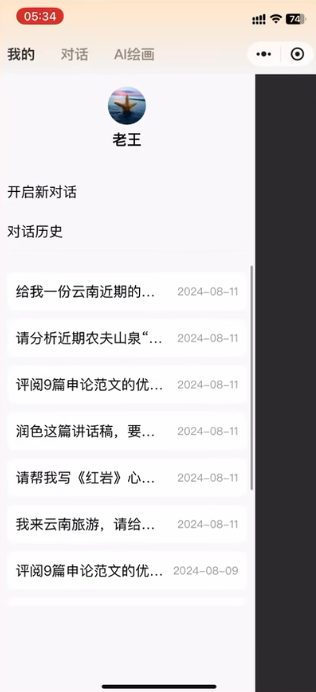
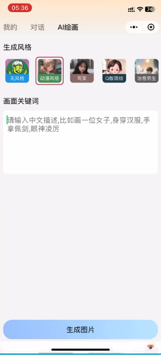

# chat-llm

## 背景介绍

### 技术选型

- 技术选型

  前端：uni-app、vue3、pinia(子组件数据传递)

  后端：nodejs、koa2；mysql、redis

  大模型：glm-4-0520(文生文)、cogview-3(文生图)

### 项目规划

## 页面设计 ✔

### text2text

- chat

  

  

- chat-streaming

  

- chat-speak

  
  
  

### history

- chat-history

  

  

### text2image

- image

  

  

## 库表设计 ✔

## 接口数据 ✔

